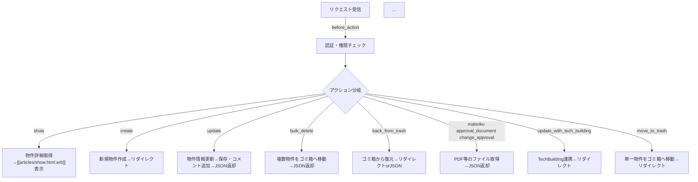

# ArticlesController

## 役割
このコントローラは[[Article]]モデルの物件データ管理（詳細表示、作成、更新、削除、ゴミ箱移動、ファイル操作など）を担当します。物件のライフサイクル全体を管理し、多数の関連モデル・ビューと連携します。

## 処理フロー

## アクション一覧
- `show`: 物件詳細を取得し、[[articles/show.html.erb]]を表示。
- `create`: 新規物件を作成し、編集画面へリダイレクト。
- `update`: 物件情報を更新し、保存内容をJSONで返却。
- `bulk_delete`: 複数物件をゴミ箱へ移動し、JSONで結果を返却。
- `back_from_trash`: ゴミ箱から物件を復元し、リダイレクトまたはJSON返却。
- `maisoku`, `approval_document`, `change_approval`: PDF等のファイル情報をJSONで返却。
- `update_with_tech_building`: TechBuilding連携を行い、リダイレクト。
- `move_to_trash`: 単一物件をゴミ箱へ移動し、リダイレクト。
- その他、多数の物件管理系アクションを実装。

## コールバック
- `before_action :set_article`（only: show, update, row, back_from_trash, maisoku, approval_document, change_approval）: 対象物件を取得。
- `skip_before_action :verify_authenticity_token`（only: bulk_delete, back_from_trash, update）: 一部アクションでCSRFチェックをスキップ。

## Strong Parameters
- `page_params`:
  - 許可: `:page`
- `maisoku_params`:
  - 許可: `:maisoku`
- `article_params`:
  - 許可: 多数の物件属性（詳細は[[Article]]参照）
- `registration_and_assessment_params`/`management_and_contract_params`:
  - 許可: base_attributes（詳細は[[Article]]参照） 