---
tags:
  - spec
  - supplier
  - db
  - rails
  - model
  - architecture
  - erd
---
# SUPPLIER by RENOSY データベース構造ドキュメント

## モデル一覧と役割

| モデル名                                     | 主な役割                 | 主要な関連                                                                                                                     |
| ---------------------------------------- | -------------------- | ------------------------------------------------------------------------------------------------------------------------- |
| [[User]]                                 | [[ユーザー]]情報を管理        | has_many :articles, has_many :approvals, has_many :intermediary_companies, ...                                            |
| [[Article]]                              | [[物件]]情報を管理          | belongs_to :user, has_many :article_items, has_many :negotiation_histories, ...                                           |
| [[ArticleItem]]                          | 物件に紐づく[[書類]]情報       | belongs_to :article, belongs_to :item, has_many :article_item_files, ...                                                  |
| [[Item]]                                 | 書類種別マスタ              | has_many :article_items                                                                                                   |
| [[Approval]]                             | [[仕入稟議]]申請管理         | belongs_to :article, belongs_to :user, has_one :approval_detail, has_many :approval_status_histories                      |
| [[ApprovalDetail]]                       | 稟議の詳細情報              | belongs_to :approval                                                                                                      |
| [[ApprovalStatusHistory]]                | 稟議のステータス履歴           | belongs_to :approval, belongs_to :actor (User), has_one :approval_status_history_comment                                  |
| [[ApprovalStatusHistoryComment]]         | ステータス履歴のコメント         | belongs_to :approval_status_history, belongs_to :user                                                                     |
| [[NegotiationHistory]]                   | [[交渉履歴]]             | belongs_to :article                                                                                                       |
| [[SaleApproval]]                         | [[販売稟議]]             | belongs_to :article, has_many :status_histories, has_one :detail                                                          |
| [[SaleApproval::StatusHistory]]          | 販売稟議のステータス履歴         | belongs_to :sale_approval, belongs_to :actor (User), has_one :comment                                                     |
| [[SaleApproval::StatusHistory::Comment]] | ステータス履歴のコメント         | belongs_to :sale_approval_status_history, belongs_to :user                                                                |
| [[SaleApproval::Detail]]                 | 販売稟議の詳細              | belongs_to :sale_approval                                                                                                 |
| [[IntermediaryCompany]]                  | [[仲介会社]]マスタ          | has_many :intermediary_staffs, belongs_to :user                                                                           |
| [[IntermediaryStaff]]                    | 仲介担当者                | belongs_to :intermediary_company, has_many :intermediary_staff_users, has_many :users, through: :intermediary_staff_users |
| [[IntermediaryStaffUser]]                | 仲介担当者とユーザーの中間        | belongs_to :intermediary_staff, belongs_to :user                                                                          |
| [[IntermediaryDomain]]                   | 仲介会社ドメイン             | belongs_to :intermediary_company, belongs_to :user                                                                        |
| [[SupplierMail]]                         | 査定メール管理              | belongs_to :contact_person (User), belongs_to :intermediary_company, has_many :attachments, has_many :articles            |
| [[Attachment]]                           | メール添付ファイル            | belongs_to :supplier_mail, belongs_to :article                                                                            |
| [[ConsumptionTaxVersion]]                | [[消費税計算]]履歴          | belongs_to :article, belongs_to :user                                                                                     |
| [[PaymentRequest]]                       | [[支払い依頼]]            | belongs_to :article, belongs_to :user, has_many :payment_request_comments                                                 |
| [[PaymentRequestComment]]                | 支払い依頼のコメント           | belongs_to :payment_request                                                                                               |
| [[SaleMaisokuProgress]]                  | [[販売用マイソク作成進捗]]      | belongs_to :article, belongs_to :creator (User), belongs_to :checker (User)                                               |
| [[SaleManagementInfo]]                   | [[発表管理]]             | belongs_to :article, belongs_to :bank                                                                                     |
| [[SalesContractField]]                   | [[契約書関連項目]]          | belongs_to :article, belongs_to :sales_contract_template                                                                  |
| [[SalesContractFile]]                    | [[契約書ファイル]]          | belongs_to :sales_contract_field, has_many :docusign_files                                                                |
| [[DocusignFile]]                         | [[DocuSignファイル]]     | belongs_to :sales_contract_file                                                                                           |
| [[SalesContractTemplate]]                | [[契約書テンプレート]]        | -                                                                                                                         |
| [[SalesDestination]]                     | [[卸先事業マスタ]]          | has_many :sales_destination_articles                                                                                      |
| [[SalesDestinationArticle]]              | 卸先事業と物件の中間           | belongs_to :sales_destination, belongs_to :article                                                                        |
| [[SalesInfo]]                            | [[発表詳細]]             | belongs_to :article                                                                                                       |
| [[SalesPropertiesSheetField]]            | [[販売物件管理スプレッドシート項目]] | belongs_to :article                                                                                                       |
| [[Building]]                             | [[建物マスタ]]            | has_many :articles                                                                                                        |
| [[BuildingConfirmation]]                 | [[建物情報確認]]           | belongs_to :article, belongs_to :user                                                                                     |
| [[Janitor]]                              | [[建物管理員]]            | belongs_to :article                                                                                                       |
| [[Jikoshintaku]]                         | [[自己信託マスタ]]          | has_many :jikoshintaku_articles, has_many :articles, through: :jikoshintaku_articles                                      |
| [[JikoshintakuArticle]]                  | 自己信託と物件の中間           | belongs_to :jikoshintaku, belongs_to :article                                                                             |
| [[OwnrInfo]]                             | [[OWNRアプリ情報]]        | belongs_to :article                                                                                                       |
| [[Comment]]                              | [[コメント]]             | belongs_to :article, belongs_to :user                                                                                     |
| [[Label]]                                | [[ラベル]]              | -                                                                                                                         |
| [[BusinessPartner]]                      | [[ビジネスパートナー]]        | has_many :users                                                                                                           |
| [[Prefecture]]                           | [[都道府県マスタ]]          | has_many :intermediary_companies                                                                                          |
| [[PricePrediction]]                      | [[価格推定結果]]           | belongs_to :article                                                                                                       |
| [[PriorValuation]]                       | [[事前評価]]             | belongs_to :article, belongs_to :user                                                                                     |
| [[PriorValuationResult]]                 | [[事前評価結果]]           | belongs_to :prior_valuation, belongs_to :bank                                                                             |
| [[Valuation]]                            | [[銀行評価]]             | belongs_to :article, belongs_to :bank                                                                                     |
| [[ValuationHistory]]                     | [[銀行評価履歴]]           | belongs_to :valuation                                                                                                     |
| ...                                      | ...                  | ...                                                                                                                       |

> ※一部省略。サブディレクトリ（input, users, types, v1等）や特殊用途モデルも含めて随時追記してください。

---

## ER図（Mermaid.js）

```mermaid
erDiagram
    USER ||--o{ ARTICLE : "has many"
    USER ||--o{ APPROVAL : "has many"
    USER ||--o{ INTERMEDIARY_COMPANY : "has many"
    USER ||--o{ INTERMEDIARY_DOMAIN : "has many"
    USER ||--o{ INTERMEDIARY_STAFF : "has many"
    USER ||--o{ SUPPLIER_MAIL : "has many"
    USER ||--o{ PAYMENT_REQUEST : "has many"
    USER ||--o{ BUILDING_CONFIRMATION : "has many"
    USER ||--o{ SALE_MAISOKU_PROGRESS : "has many (creator/checker)"
    USER ||--o{ CONSUMPTION_TAX_VERSION : "has many"
    USER ||--o{ PRIOR_VALUATION : "has many"
    USER ||--o{ COMMENT : "has many"
    USER ||--o{ USERS_SETTING : "has one"
    USER ||--o{ INTERMEDIARY_STAFF_USER : "has many"
    USER ||--o{ APPROVAL_STATUS_HISTORY : "as actor"
    USER ||--o{ SALE_APPROVAL_STATUS_HISTORY : "as actor"

    ARTICLE ||--o{ ARTICLE_ITEM : "has many"
    ARTICLE ||--o{ NEGOTIATION_HISTORY : "has many"
    ARTICLE ||--o{ APPROVAL : "has many"
    ARTICLE ||--o{ PAYMENT_REQUEST : "has many"
    ARTICLE ||--o{ SALE_MAISOKU_PROGRESS : "has many"
    ARTICLE ||--o{ SALE_MANAGEMENT_INFO : "has many"
    ARTICLE ||--o{ SALES_CONTRACT_FIELD : "has many"
    ARTICLE ||--o{ SALES_INFO : "has one"
    ARTICLE ||--o{ SALES_PROPERTIES_SHEET_FIELD : "has one"
    ARTICLE ||--o{ BUILDING_CONFIRMATION : "has many"
    ARTICLE ||--o{ JANITOR : "has one"
    ARTICLE ||--o{ JIKOSHINTAKU_ARTICLE : "has many"
    ARTICLE ||--o{ OWN_INFO : "has one"
    ARTICLE ||--o{ COMMENT : "has many"
    ARTICLE ||--o{ PRICE_PREDICTION : "has many"
    ARTICLE ||--o{ PRIOR_VALUATION : "has many"
    ARTICLE ||--o{ VALUATION : "has many"
    ARTICLE ||--o{ SALES_DESTINATION_ARTICLE : "has many"
    ARTICLE ||--o{ DOCUMENT_PROGRESS : "has many"
    ARTICLE ||--o{ CONSUMPTION_TAX_VERSION : "has many"
    ARTICLE ||--o{ PURCHASE_CONTRACT : "has many"

    ARTICLE_ITEM }o--|| ITEM : "belongs to"
    ARTICLE_ITEM ||--o{ ARTICLE_ITEM_FILE : "has many"
    ARTICLE_ITEM ||--o{ INPUT_CERTIFIED_COPY : "has one"
    ARTICLE_ITEM ||--o{ INPUT_TENANT_LEASE_AGREEMENT : "has one"
    ARTICLE_ITEM ||--o{ INPUT_REPORT_OF_IMPORTANT_INFO_SURVEY : "has one"
    ARTICLE_ITEM ||--o{ INPUT_SALES_AGREEMENT_ON_PURCHASE : "has one"
    ARTICLE_ITEM ||--o{ INPUT_PAMPHLET : "has one"
    ARTICLE_ITEM ||--o{ INPUT_CONSULTING_OUTSOURCING_AGREEMENT : "has one"
    ARTICLE_ITEM ||--o{ INPUT_COMPENSATION_PAYMENT_AGREEMENT : "has one"
    ARTICLE_ITEM ||--o{ INPUT_SALES_AGREEMENT_AB : "has one"
    ARTICLE_ITEM ||--o{ INPUT_VALUATION_CERTIFICATE : "has one"

    APPROVAL ||--|| APPROVAL_DETAIL : "has one"
    APPROVAL ||--o{ APPROVAL_STATUS_HISTORY : "has many"
    APPROVAL_STATUS_HISTORY ||--|| APPROVAL_STATUS_HISTORY_COMMENT : "has one"

    SALE_APPROVAL ||--o{ SALE_APPROVAL_STATUS_HISTORY : "has many"
    SALE_APPROVAL ||--|| SALE_APPROVAL_DETAIL : "has one"
    SALE_APPROVAL_STATUS_HISTORY ||--|| SALE_APPROVAL_STATUS_HISTORY_COMMENT : "has one"

    INTERMEDIARY_COMPANY ||--o{ INTERMEDIARY_STAFF : "has many"
    INTERMEDIARY_COMPANY ||--o{ INTERMEDIARY_DOMAIN : "has many"
    INTERMEDIARY_STAFF ||--o{ INTERMEDIARY_STAFF_USER : "has many"
    INTERMEDIARY_STAFF_USER }o--|| USER : "belongs to"
    INTERMEDIARY_DOMAIN }o--|| USER : "belongs to"

    SUPPLIER_MAIL ||--o{ ATTACHMENT : "has many"
    SUPPLIER_MAIL ||--o{ ARTICLE : "has many"
    ATTACHMENT }o--|| ARTICLE : "belongs to"

    SALES_CONTRACT_FIELD ||--o{ SALES_CONTRACT_FILE : "has many"
    SALES_CONTRACT_FILE ||--o{ DOCUSIGN_FILE : "has many"

    SALES_DESTINATION ||--o{ SALES_DESTINATION_ARTICLE : "has many"
    SALES_DESTINATION_ARTICLE }o--|| ARTICLE : "belongs to"

    JIKOSHINTAKU ||--o{ JIKOSHINTAKU_ARTICLE : "has many"
    JIKOSHINTAKU_ARTICLE }o--|| ARTICLE : "belongs to"

    PAYMENT_REQUEST ||--o{ PAYMENT_REQUEST_COMMENT : "has many"

    BUILDING ||--o{ ARTICLE : "has many"

    PRIOR_VALUATION ||--o{ PRIOR_VALUATION_RESULT : "has many"
    PRIOR_VALUATION_RESULT }o--|| BANK : "belongs to"
    VALUATION ||--o{ VALUATION_HISTORY : "has many"
    VALUATION }o--|| BANK : "belongs to"

```



---

## テーブル定義詳細

### users テーブル

| カラム名 | データ型 | 備考 |
|---|---|---|
| id | integer | 主キー |
| email | string | null: false, default: "", コメント: メールアドレス |
| encrypted_password | string | null: false, default: "", コメント: 暗号化パスワード |
| sign_in_count | integer | null: false, default: 0, コメント: サインイン回数 |
| current_sign_in_at | datetime | コメント: 現サインイン日時 |
| last_sign_in_at | datetime | コメント: 前回サインイン日時 |
| current_sign_in_ip | inet | コメント: 現サインインIP |
| last_sign_in_ip | inet | コメント: 前回サインインIP |
| name | string | コメント: 名前 |
| created_at | datetime | null: false |
| updated_at | datetime | null: false |
| type | string | null: false, default: "Salesperson", コメント: タイプ |
| chatwork_id | integer | コメント: チャットワークID |
| department_id | integer | コメント: 使用していない |
| mobile_phone | string | コメント: 携帯電話番号 |
| authority | text[] | null: false, default: [], コメント: 権限管理用カラム |
| business_partner_id | integer | コメント: ビジネスパートナーID |
| leave | boolean | null: false, default: false, コメント: 退職フラグ |

---

### articles テーブル

| カラム名 | データ型 | 備考（null制約・default・コメント等） |
|---|---|---|
| id | bigint | 主キー |
| building_name | text | 建物名 |
| zip | string | 郵便番号 |
| prefecture | text | 住所１ |
| state | text | 住所２ |
| city | text | 住所３ |
| street | text | 住所４ |
| area | integer | 使用していない |
| built_year | integer | 築年月 |
| station_name | text | 最寄駅１ |
| station_walk_minute | integer | 駅徒歩（分）１ |
| building_facility | text | 使用していない |
| building_structure | string | 建物構造（enum） |
| total_rooms | integer | 総戸数 |
| stories_high | integer | 地上階層 |
| floor | integer | 所在階 |
| room_layout | string | 間取り（enum） |
| footprint | float | 専有面積 |
| room_facility | text | 使用していない |
| supply_price | integer | 売り出し価格 |
| sale_price | integer | 販売価格 |
| administrative_cost | integer | 管理費 |
| repair_reserve_fund | integer | 修繕積立金 |
| rental_price | integer | 賃料 |
| current_situation | integer | 現況（enum） |
| land_rights | integer | 土地権利（enum） |
| company_name | text | 仲介会社名 |
| contact_phone | text | 仲介連絡先 |
| company_phone | text | 仲介代表番号 |
| management_company | text | 建物管理会社 |
| article_no | bigint | レインズ物件番号 |
| maisoku_url | text | マイソクURL |
| for_investment | boolean | 投資物件フラグ |
| created_date | date | レインズ登録日 |
| reins_updated_date | date | レインズ更新日 |
| created_at | datetime | null: false |
| updated_at | datetime | null: false |
| status | integer | 仕入ステータス |
| predetermined_price | integer | default: 0, 販売予想価格 |
| tsubo_unit_amount | integer | default: 0, 坪単価 |
| creator_id | integer | 作成者（ユーザー）ID |
| supplier_mail_id | integer | 査定メールID |
| user_id | integer | ユーザーID |
| owner_preferred_price | integer | オーナー希望価格 |
| intermediary_preferred_price | integer | 仲介希望価格 |
| suppliy_preferred_price | integer | 希望価格 |
| sales_month | string | default: "", null: false, 販売月 |
| assumed_rental_price | integer | 想定賃料 |
| room_number | string | 部屋番号 |
| maisoku_pdf_md5 | string | default: "", マイソクPDFのMD5 |
| maisoku_thumbnail_md5 | string | default: "", マイソクサムネイルのMD5 |
| supplier_phase | integer | 登録、査定、案件、契約・発表のフェーズを管理 |
| cfm_request_date | date | 確認依頼日 |
| release_date | date | 発表日 |
| purchase_date | date | 仕入日 |
| sales_start_date | date | 販売開始日 |
| contract_start_date | date | 契約開始日 |
| settlementable_date | date | 決済可能日 |
| about_settlementable_date | string | 決済可能日（見込） |
| charges_all_collected | boolean | default: false, null: false, 諸費用全回収フラグ |
| owned | boolean | default: false, null: false, 自決有無フラグ |
| self_settlement_period | date | 自決期限 |
| manage_type | boolean | default: false, null: false, 自決管理フラグ |
| sublease_contract_months | integer | サブリース標準契約期間（月） |
| sublease_contract_price | integer | サブリース標準家賃 |
| agency_contract_months | integer | 集金代行標準契約期間（月） |
| agency_contract_price | integer | 集金代行標準家賃 |
| floor_backup | integer | 使用していない |
| owner_name | string | 売主 |
| mortgage_bank | string | 抵当権金融機関 |
| deleted | boolean | default: false, null: false, 削除フラグ |
| sales_area | integer | 販売エリア |
| etc_expenses_price | integer | 諸費用金額 |
| designated_financial | text | 指定金融機関 |
| classification | integer | default: 1, 種別 |
| renosy_release | boolean | default: false, リノシー公開フラグ |
| purchase_price | integer | 仕入れ価格 |
| email_replied_at | datetime | メール返信日時 |
| replied_supplier_preferred_price | integer | 返信した希望価格 |
| supplier_preferred_price_included_fee | boolean | default: false, null: false, 希望価格手数料込フラグ |
| tech_consul_status | integer | default: 0, null: false, Tech Consulの物件ステータス |
| google_drive_url | text | GoogleドライブのURL |
| station_name_2 | text | 最寄駅2 |
| station_walk_minute_2 | integer | 最寄り駅2徒歩(分) |
| line_name_1 | text | 路線名1 |
| line_name_2 | text | 路線名2 |
| line_name_3 | text | 路線名3 |
| station_name_3 | text | 最寄駅3 |
| station_walk_minute_3 | integer | 最寄駅3徒歩(分) |
| unnecessary_to_reply | boolean | default: false, null: false, 返信不要フラグ |
| recommend_comment | text | GAからのコメント |
| room_plan | text | 間取り図 ファイルパス |
| room_plan_md5 | text | 間取り図 MD5 |
| is_vacant | boolean | default: false, 賃貸中 or 退去済 |
| land_category | text | 地目 |
| land_use_zone | text | 地域・地区 |
| building_coverage_ratio | float | 建ぺい率 |
| floor_area_ratio | float | 容積率 |
| site_area | float | 敷地面積 |
| management_form | text | 管理形態 |
| construction_company | text | 施工会社 |
| control_room | text | 管理室 |
| elevator | text | エレベーター |
| bicycle_parking | text | 駐輪場 |
| parking | text | 駐車場 |
| motorcycle_parking | text | バイク置場 |
| garbage_collection_point | text | ごみ集積場 |
| collective_mailbox | text | 集合郵便受け |
| delivery_box | text | 宅配ボックス |
| has_auto_lock | text | オートロック |
| tv_viewing_environment | text | TV等視聴環境 |
| public_facilities | text | 公共設備 |
| entrance | text | 玄関 |
| bathroom | text | バスルーム |
| wash_room | text | トイレ |
| kitchen | text | キッチン |
| air_conditioning | text | 冷暖房 |
| electricity | text | 電気 |
| gas | text | ガス |
| water_supply | text | 給水 |
| hot_water_supply | text | 給湯 |
| ventilation | text | 換気 |
| telephone | text | 電話 |
| tv | text | TV |
| internet | text | インターネット |
| building_management_company | text | 建物管理会社名 |
| intermediary_id | integer | 仲介会社ID |
| gallery_link_code | string | マイソクQRコード リンク用コード |
| total_building_area | float | 延べ床面積 |
| recommend_comment_title | text | おすすめコメントタイトル |
| design_company | string | 設計会社 |
| supervision_company | string | 監理会社 |
| building_price_of_register | integer | 証明書記載建物金額 |
| land_price_of_register | integer | 証明書記載土地金額 |
| equity_denominator_of_register | bigint | 証明書記載持分分母 |
| equity_numerator_of_register | bigint | 証明書記載持分分子 |
| fixed_property_tax_base_of_land | integer | 証明書記載固定資産税課税標準額(土地) |
| fixed_property_tax_base_of_building | integer | 証明書記載固定資産税課税標準額(建物) |
| city_plan_tax_base_of_land | integer | 証明書記載都市計画税課税標準額(土地) |
| city_plan_tax_base_of_building | integer | 証明書記載都市計画税課税標準額(建物) |
| contract_date | date | 成約日 |
| contracted_by | integer | 成約者 |
| fix_property_tax | integer | 固定資産税 |
| city_planning_tax | integer | 都市計画税 |
| real_estate_acquisition_tax | integer | 不動産取得税 |
| maisoku_request_id | string | マイソクリーダー読み取りリクエストID |
| collected_charges | integer | 諸費用回収額 |
| insight_release | boolean | default: false, null: false, Renosy Insight公開フラグ |
| other_cost | integer | その他費用 |
| settlement_month | integer | 決済月 |
| etc_expenses_price_collect_forcibly | boolean | default: false, null: false, 諸費用強制回収フラグ |
| mercury_project_id | integer | プロジェクト情報管理ID1 |
| mercury_room_id | integer | 新築マンション住戸ID |
| building_id | integer | GAの建物マスタ |
| linked_at_with_project | datetime | GAの建物マスタ関連時間 |
| room_id | integer | GA部屋マスタID |
| linked_at_with_room | datetime | GA部屋マスタ関連時間 |
| consul_article_id | integer | Tech Consulのarticle_id |
| rooms_info | jsonb | 関連部屋情報 |
| tiban | text | 地番 |
| jyukyo | text | 住居表示 |
| unit_kanri | integer | 管理室数 |
| unit_syukai | integer | 集会室数 |
| unit_hibun | integer | 非分譲数 |
| unit_souhan | integer | 総販売戸数 |
| kan_ovr | text | 管理会社2超 |
| area_build | float | 建築面積 |
| unit_parking | integer | 駐車場合計台数 |
| unit_park_in | integer | 賃貸駐車場台数(敷地内) |
| unit_park_out | integer | 賃貸駐車場台数(敷地外) |
| unit_park_sell | integer | 分譲駐車場台数 |
| unit_park_hoka | integer | その他駐車場台数 |
| touname | text | 棟名 |
| roomno_ini | text | 部屋番号(文字型) |
| men_bal | float | バルコニー面積 |
| men_rbal | float | ルーフバルコニー面積 |
| men_gar | float | 専用庭面積 |
| data_maintainer_confirmed | boolean | default: false, null: false, データ整備者確認フラグ |
| want_status | integer | default: 0, ランク |
| negotiation_status | integer | default: 0, 交渉感触 |
| next_negotiation_date | datetime | 次回交渉日 |
| other_company_price | integer | 他社価格 |
| maisoku_remarks | text | マイソク用備考 |
| zenrin_map_zoom | integer | default: 11, null: false, ゼンリンマップ拡大率 |
| land_right_migration_and_storage_charge | float | default: 0.0062, 所有権移転・保存費用 |
| mortgage_establishing_charge | float | default: 0.0065, 抵当権設定費用 |
| fix_property_tax_liquidation_money | integer | 固定資産税清算金 |
| customer_sales_agreement_stamp_cost | integer | default: 30000, 契約書印紙代 |
| repair_reserve_fund_etc | integer | default: 0, 修繕積立基金等 |
| fire_insurance_premium | integer | default: 20000, 火災保険料 |
| loan_fee | integer | default: 108000, ローン事務手数料 |
| consumption_tax | integer | 消費税 |
| land_price_of_register_1 | bigint | 証明書記載土地金額(1) |
| land_price_of_register_2 | bigint | 証明書記載土地金額(2) |
| land_price_of_register_3 | bigint | 証明書記載土地金額(3) |
| land_price_of_register_4 | bigint | 証明書記載土地金額(4) |
| land_price_of_register_5 | bigint | 証明書記載土地金額(5) |
| fixed_property_tax_base_of_land_1 | integer | 証明書記載固定資産税課税標準額(土地)(1) |
| fixed_property_tax_base_of_land_2 | integer | 証明書記載固定資産税課税標準額(土地)(2) |
| fixed_property_tax_base_of_land_3 | integer | 証明書記載固定資産税課税標準額(土地)(3) |
| fixed_property_tax_base_of_land_4 | integer | 証明書記載固定資産税課税標準額(土地)(4) |
| fixed_property_tax_base_of_land_5 | integer | 証明書記載固定資産税課税標準額(土地)(5) |
| fixed_property_tax_base_of_building_1 | integer | 証明書記載固定資産税課税標準額(建物)(1) |
| fixed_property_tax_base_of_building_2 | integer | 証明書記載固定資産税課税標準額(建物)(2) |
| fixed_property_tax_base_of_building_3 | integer | 証明書記載固定資産税課税標準額(建物)(3) |
| fixed_property_tax_base_of_building_4 | integer | 証明書記載固定資産税課税標準額(建物)(4) |
| fixed_property_tax_base_of_building_5 | integer | 証明書記載固定資産税課税標準額(建物)(5) |
| city_plan_tax_base_of_land_1 | integer | 証明書記載都市計画税課税標準額(土地)(1) |
| city_plan_tax_base_of_land_2 | integer | 証明書記載都市計画税課税標準額(土地)(2) |
| city_plan_tax_base_of_land_3 | integer | 証明書記載都市計画税課税標準額(土地)(3) |
| city_plan_tax_base_of_land_4 | integer | 証明書記載都市計画税課税標準額(土地)(4) |
| city_plan_tax_base_of_land_5 | integer | 証明書記載都市計画税課税標準額(土地)(5) |
| city_plan_tax_base_of_building_1 | integer | 証明書記載都市計画税課税標準額(建物)(1) |
| city_plan_tax_base_of_building_2 | integer | 証明書記載都市計画税課税標準額(建物)(2) |
| city_plan_tax_base_of_building_3 | integer | 証明書記載都市計画税課税標準額(建物)(3) |
| city_plan_tax_base_of_building_4 | integer | 証明書記載都市計画税課税標準額(建物)(4) |
| city_plan_tax_base_of_building_5 | integer | 証明書記載都市計画税課税標準額(建物)(5) |
| fixed_property_tax_1 | integer | 固定資産税(相当額)(1) |
| fixed_property_tax_2 | integer | 固定資産税(相当額)(2) |
| fixed_property_tax_3 | integer | 固定資産税(相当額)(3) |
| fixed_property_tax_4 | integer | 固定資産税(相当額)(4) |
| fixed_property_tax_5 | integer | 固定資産税(相当額)(5) |
| city_planning_tax_1 | integer | 都市計画税(相当額)(1) |
| city_planning_tax_2 | integer | 都市計画税(相当額)(2) |
| city_planning_tax_3 | integer | 都市計画税(相当額)(3) |
| city_planning_tax_4 | integer | 都市計画税(相当額)(4) |
| city_planning_tax_5 | integer | 都市計画税(相当額)(5) |
| building_tax | integer | 建物税 |
| sublease_handed_over | boolean | サブリース引き継ぎフラグ |
| has_certificate_of_valuation_when_simulated | boolean | シミュレーション時評価証明有無 |
| other_cost_name | string | その他費用名 |
| sublease_handed_over_from | string | サブリース契約先 |
| other_cost_breakdown | text | その他費用内訳 |
| fixed_property_tax_6 | integer | 固定資産税(相当額)(6) |
| fixed_property_tax_7 | integer | 固定資産税(相当額)(7) |
| fixed_property_tax_8 | integer | 固定資産税(相当額)(8) |
| city_planning_tax_6 | integer | 都市計画税(相当額)(6) |
| city_planning_tax_7 | integer | 都市計画税(相当額)(7) |
| city_planning_tax_8 | integer | 都市計画税(相当額)(8) |
| room_category | string | default: "居宅", 専有部分の種類 |
| building_structure_article_part | string | default: "鉄筋コンクリート造1階建", 専有部分の建物構造 |
| management_company_tel | string | 建物管理会社TEL |
| management_company_address | text | 建物管理会社住所 |
| management_company_registered_no | string | default: "国土交通大臣(●)第●●●号", (建物管理会社)マンション管理適正化法による登録番号 |
| top_assumed_rental_price | integer | 想定賃料（上限） |
| bottom_assumed_rental_price | integer | 想定賃料（下限） |
| contract_start_at | datetime | 契約開始日時 |
| is_two_party_contract | boolean | 2者間フラグ |
| uploaded_files | text[] | default: [], アップロード済ファイル名(items.nameを配列で保存) |
| brokerage_commissions | integer | 仲介手数料 |
| offer_amount | integer | 買い付け金額 |
| issue_stamp_cost | integer | 印紙発行代 |
| approval_condition_1 | text | 稟議書諸条件1 |
| approval_condition_2 | text | 稟議書諸条件2 |
| approval_condition_3 | text | 稟議書諸条件3 |
| approval_condition_4 | text | 稟議書諸条件4 |
| etc_expenses_recoveries | string | 諸費用回収 |
| loan_year | integer | ローン年数 |
| deposit | integer | 手付金 |
| at_vacancy | boolean | 空室 |
| various_cost_recovery | integer | 諸費用回収 |
| various_cost_modify | integer | 諸費用修正 |
| age_of_building | integer | 築年数 |
| vacancy_comment | text | 空室状況 |
| repair_history | boolean | 修繕履歴 |
| supplier_sales_agreement_stamp_cost | integer | default: 10000, 契約書印紙代 |
| shooting_date | string | 撮影日 |
| self_settled_date | date | 自決した日 |
| negotiation_status_very_gooded_at | datetime | 交渉感触が◎になった日時 |
| net_value | float | メール自動返信時の利回りを保存する |
| intermediary_staff_name | string | 仲介担当者名 |
| intermediary_staff_tel | string | 仲介担当者電話番号 |
| sales_properties_sheet_status | integer | default: 0, null: false, 販売物件管理スプレッドシートとの連携状況 |
| procurement_transaction_date | date | 約定日（仕入れ） |
| intermediary_branch_office_id | bigint | 仲介支店ID |
| sbj_sale_price | integer | SBJ銀行を利用した場合の販売金額 |
| created_by_management_staff | boolean | default: false, null: false, 賃貸チームで作成したフラグ |
| room_aspect | string | 方角 |
| existence_of_ga_registration | integer | default: 0, null: false, GA登記ありなし未指定（enum） 0:未指定 10:なし 20:あり |
| fund_source | integer | default: 0, null: false, 資金（enum） 0:未指定 10:キャッシュ 20:三井トラスト 1000:その他 |
| rental_contract_from | date | 賃貸契約開始日 |
| rental_contract_to | date | 賃貸契約満了日 |
| tenant_segment | integer | default: 0, null: false, 法人契約区分 0:個人 1:法人 |
| managed_in_moving_out | boolean | default: false, null: false, 退去後GA管理フラグ |
| maisoku_remarks_edited_manually | boolean | default: false, null: false, マイソク備考欄手動編集フラグ |
| balcony_footprint | float | バルコニー面積 |
| apartment_location | integer | default: 0, null: false, 角部屋（enum） |
| maisoku_obikeshi_status | integer | default: 0, null: false, 0:未対応 10:帯消しlambda実行済 20:帯消しOK 30:帯消しすぎ 40:帯消し不足 |
| maisoku_obikeshi_checker_id | integer | マイソク帯消し確認者ID |
| assumed_rental_price_check_month | integer | 周辺相場調査月 |
| reins_on_sale_confirmation_datetime | datetime | レインズ物件確認日時 |
| motodzuke_intermediary_name | string | 元付仲介会社名 |
| maisoku_cloudinary_key | string | マイソク画像CloudinaryKey |
| ga_registered_date | date | GA登記日 |
| ga_registered_date_2 | date | GA登記日（登記日に変更があった場合） |
| tech_building_id | integer | default: 0, null: false, Tech Buildingの建物ID |
| tech_building_room_id | integer | default: 0, null: false, Tech BuildingのroomID |
| water_bill | integer | 水道料金 |
| water_bill_remarks | text | 水道料金備考 |
| sales_priority | integer | default: 0, 販売優先順位 |
| discountable_amount | integer | default: 0, 値引き可能額 |
| ref_monthly_cash_flow | integer | 月額のキャッシュフロー（参考） |
| major_station | string | 主要駅 |
| station_name_to_major_station | string | 主要駅へ利用する駅名 |
| line_name_to_major_station | string | 主要駅へ利用する路線 |
| minute_to_major_station | integer | 主要駅への乗車時間（分） |
| street_for_search_map | string | 地図検索用番地 |
| street_for_search_map_edited_manually | boolean | default: false, null: false, 地図検索用番地の手動入力 |
| dealing_offices | integer[] | default: [1,2,3,4,5], null: false, 公開拠点 |
| rank_total | string | 物件ランク（総合） |
| rank_area | string | 物件ランク（場所） |
| rank_sale_price | string | 物件ランク（価格） |
| rank_rental_price | string | 物件ランク（賃料） |
| ranked_at | datetime | ランク取得日 |
| rank_for_consul | string | 物件ランク（コンサル連携用） |
| rank_for_consul_changed_reason | string | 物件ランク変更理由（コンサル連携用） |
| maisoku_downloaded_at | datetime | マイソクダウンロード日時 |
| other_contract_cost_item_1 | string | その他契約費用：項目1 |
| other_contract_cost_amount_1 | integer | その他契約費用：金額1 |
| other_contract_cost_item_2 | string | その他契約費用：項目2 |
| other_contract_cost_amount_2 | integer | その他契約費用：項目2 |
| other_contract_cost_item_3 | string | その他契約費用：項目3 |
| other_contract_cost_amount_3 | integer | その他契約費用：金額3 |
| payment_for_contract_conclusion_item | integer | 契約時支払い項目 |
| payment_for_contract_conclusion_amount | integer | 契約時支払い金額 |
| existence_of_elevator | boolean | エレベーターの有無 |
| appeared_on_oshima_teru | boolean | 大島てる該当有無 |
| indoor_washing_machine_storage | boolean | 室内洗濯機置き場の有無 |
| first_floor_check | boolean | 1Fチェック |
| valuation_status_for_jaccs | integer | 担保評価確認状況（ジャックス） |
| valuation_status_for_orix | integer | 担保評価確認状況（オリックス） |
| developer | string | 分譲会社 |
| issue_stamp_cost_payment_method | integer | 印紙代支払い方法 |
| bounding_box | string | 帯の位置： 画像左上を起点に left,top,width,height |
| flow_id | integer | FLOW_ID |
| maisoku_display_major_station | boolean | default: true, マイソク主要駅表示 |
| anti_company_checked | boolean | default: false, 反社チェック済フラグ |
| tech_building_id_rewritten_at | datetime | TechBuilding書き換え日時 |
| intermediary_company_id | integer | 新仲介会社ID |
| intermediary_domain_id | integer | 新仲介ドメインID |
| intermediary_staff_id | integer | 新仲介担当者ID |
| bathroom_type | integer | バス・トイレタイプ(enum: 2点、3点など) |
| psychological_defects | integer | 心理的瑕疵(enum: 掲載箇所など) |
| debt | integer | 借入金(enum: あり、なし（今後〜円以上など入る予定）) |
| maisoku_check | boolean | default: false, null: false, マイソクチェック(バイヤー) |
| anti_company_checked_tenant | boolean | default: false, 反社チェック済フラグ（賃借人） |
| self_settlement_reason | integer | default: 0, null: false, 自決理由 |
| issue_stamp_cost_payoff | integer | 印紙発行代(精算時) |
| issue_stamp_cost_payment_method_payoff | integer | default: 0, null: false, 印紙代支払い方法(精算時) |
| sale_available_status | integer | default: 0, null: false, 物件公開ステータス |
| sale_available_comment | text | 物件公開コメント |
| deregistration_checked_date | date | 売主決済日 |
| adjust_sale_price | integer | 評価上げ |
| supply_company_id | integer | 仕入会社ID |
| sublease_company | string | default: "", null: false, サブリース会社 |
| consumption_tax_difference_type | integer | default: 0, null: false, 消費税差額タイプ(enum) |
| open_status | integer | null: false, 公開ステータス(enum) |
| saleable_status | integer | null: false, 発表ステータス(enum) |
| sales_date | date | 販売日 |
| is_kanrigae | boolean | default: false, null: false, 管理替えかどうかのフラグ |

// ...（インデックスやユニーク制約は必要に応じて補足）

---

### article_items テーブル

| カラム名 | データ型 | 備考 |
|---|---|---|
| id | integer | 主キー |
| item_id | integer | コメント: 書類ID |
| article_id | integer | コメント: 物件ID |
| uploaded_date | date | コメント: アップロード日 |
| schd_upload_date | date | コメント: アップロード予定日 |
| remark | text | コメント: 備考 |
| additionally_confirmed | boolean | コメント: 備考チェック |
| created_at | datetime | null: false |
| updated_at | datetime | null: false |

---

### approvals テーブル

| カラム名 | データ型 | 備考 |
|---|---|---|
| id | integer | 主キー |
| article_id | integer | コメント: article_id |
| user_id | integer | コメント: user_id |
| name | string | コメント: 稟議書（carrierwaveでマウントするカラム） |
| change_name | string | コメント: 変更稟議事情説明書（carrierwaveでマウントするカラム） |
| status | integer | コメント: 稟議のステータス |
| kintone_id | integer | コメント: kintone上でのID |
| no | integer | コメント: 稟議申請回数。2以降は変更稟議。 |
| comment | text | コメント: コメント |
| created_at | datetime | null: false |
| updated_at | datetime | null: false |
| ... | ... | ... |

---

### intermediary_companies テーブル

| カラム名 | データ型 | 備考 |
|---|---|---|
| id | integer | 主キー |
| name | string | null: false, コメント: 仲介会社名 |
| user_id | integer | コメント: GA担当者 |
| monthly_handing_number | integer | コメント: 1ヶ月の取り扱い件数 |
| ... | ... | ... |

---

### sales_contract_fields テーブル

| カラム名 | データ型 | 備考 |
|---|---|---|
| id | integer | 主キー |
| article_id | integer | コメント: article_id |
| created_at | datetime | null: false |
| updated_at | datetime | null: false |
| has_accessory_building | boolean | default: false, コメント: 付属建物の有無 |
| ... | ... | ... |

> ※各テーブルの全カラム詳細は[[schema.rb]]や各種ノートで参照してください。

---

（この他のテーブルも必要に応じて追記してください） 

---

## 全モデル名リスト（ファイル・クラス名ベース/サブディレクトリ含む）

- year_month.rb
- yield_calculator.rb
- zenrin_map.rb
- valuation.rb
- valuation_history.rb
- unmounted_article_item_file.rb
- user.rb
- suggested_rental_price.rb
- supplier.rb
- supplier_mail.rb
- system_setting.rb
- tax.rb
- sales_properties_sheet_field.rb
- sales_term.rb
- salesperson.rb
- sanitize_building_name.rb
- settlement_agent.rb
- shooting_info.rb
- sales_contract_template.rb
- sales_destination.rb
- sales_destination_article.rb
- sales_info.rb
- sale_maisoku_progress.rb
- sale_management_info.rb
- sale_price_calculator.rb
- sales_contract_field.rb
- sales_contract_file.rb
- purchase_contract.rb
- sale_approval.rb
- pdf.rb
- prefecture.rb
- price_prediction.rb
- prior_valuation.rb
- other_company_negotiation.rb
- ownr_info.rb
- payment_request.rb
- payment_request_comment.rb
- manager.rb
- mst_jusyo_jp.rb
- negotiation_history.rb
- negotiation_schedule.rb
- notifier.rb
- item.rb
- janitor.rb
- jikoshintaku.rb
- jikoshintaku_article.rb
- label.rb
- lancers_operator.rb
- loan_agent.rb
- mail_body_extractor.rb
- intermediary_company.rb
- intermediary_domain.rb
- intermediary_staff.rb
- intermediary_staff_user.rb
- grow_year_month_formatter.rb
- incomplete_document.rb
- input.rb
- file_published_date.rb
- file_tab.rb
- file_tab_collection.rb
- docusign_file.rb
- docusign_info.rb
- document_progress_label.rb
- current.rb
- data_maintainer.rb
- document_manager.rb
- document_progress.rb
- consumption_tax_version.rb
- cash_flow_calculator.rb
- cash_flow_criterion_article.rb
- cash_flow_criterion_calculator.rb
- comment.rb
- business_partner.rb
- buyback_reason.rb

### サブディレクトリ（抜粋）

#### input/
- valuation_certificate.rb
- consulting_outsourcing_agreement.rb
- pamphlet.rb
- report_of_important_info_survey.rb
- sales_agreement_ab.rb
- sales_agreement_on_purchase.rb
- tenant_lease_agreement.rb
- compensation_payment_agreement.rb
- confirmation.rb
- compare.rb
- check.rb
- base.rb
- certified_copy.rb

#### input/check/
- pamphlet.rb
- report_of_important_info_survey.rb
- sales_agreement_ab.rb
- sales_agreement_on_purchase.rb
- tenant_lease_agreement.rb
- valuation_certificate.rb
- base.rb
- certified_copy.rb
- compensation_payment_agreement.rb
- consulting_outsourcing_agreement.rb

#### input/confirmation/
- tenant_lease_agreement.rb
- valuation_certificate.rb
- pamphlet.rb
- report_of_important_info_survey.rb
- sales_agreement_ab.rb
- sales_agreement_on_purchase.rb
- base.rb
- certified_copy.rb
- compensation_payment_agreement.rb
- consulting_outsourcing_agreement.rb

#### input/compare/
- compensation_payment_agreement.rb
- report_of_important_info_survey.rb
- sales_agreement_on_purchase.rb
- tenant_lease_agreement.rb
- certified_copy.rb

#### input/certified_copy/
- form.rb
- land_address.rb

#### users/
- setting.rb

#### user/
- authorizer.rb

#### types/
- type_date_time_with_zone.rb

#### tech_building/
- building_image.rb
- advertisement_railway_station.rb
- building.rb
- building_file.rb
- building_files_fetcher.rb

#### negotiation_history/
- presenter.rb

#### valuation_history/
- presenter.rb

#### sale_approval/
- status_history.rb
- create_form.rb
- detail.rb

#### sales_contract_files/
- renosy_wide_sublease_management_fee.rb
- sales_agreement.rb
- transfer_request_form.rb
- vacancy_guarantee_agreement.rb
- presentation_of_important_info_collection_agency_pro.rb
- ...（多数）

#### prior_valuation/
- index_form.rb
- result.rb
- create_form.rb

#### purchase_contract/
- cancellation.rb
- transaction_register.rb

#### payment_request/
- send_to_flow.rb
- update_form.rb

#### document_progresses/
- api_client.rb
- api_response_formatter.rb
- card_list_builder.rb

#### certified_copy/
- ...

#### shiho_shoshi/
- registration_document_builder.rb
  - registration_documents/
    - base.rb
    - normal.rb
    - orix.rb

#### sale_maisoku/
- pdf_generator.rb

#### sale_maisoku_progress/
- status_manager.rb

#### notifiers/
- rental_price_assessment_request.rb
- valuation_certificate_required_articles.rb
- ownr_bring_back_contract_files.rb

#### csv/
- generator.rb
- prior_valuation.rb
- purchase_contract.rb

#### validator/
- date.rb

#### form/
- negotiation_history.rb
- valuation_histories.rb

#### google_api/
- authorizer.rb
- gmail.rb

#### document_reader/maisoku/
- article_response_formatter.rb
- article_updater.rb

---

```dataviewjs
dv.header(3, "関連ノート");
var maxLoop = Math.min(dv.current().file.tags.length, 3);
for(let i=0;i<maxLoop;i++){
dv.span(dv.current().file.tags[i]);
dv.list(dv.pages(dv.current().file.tags[i]).sort(f=>f.file.mtime.ts,"desc").limit(15).file.link);
}
```