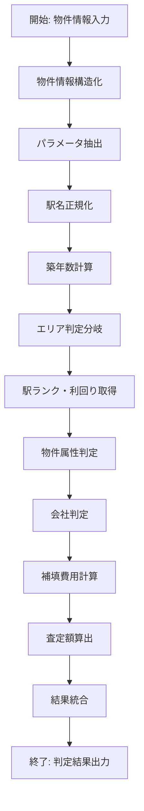

# Dify 仕入判定アプリケーション マニュアル

本マニュアルでは、Difyを用いて開発された「【開発中】仕入判定_ver2.1_全国対応」アプリケーションの仕様と運用方法について説明します。

## 📋 アプリケーション概要

### 基本情報
- **アプリケーション名**: 【開発中】仕入判定_ver2.1_全国対応
- **説明**: 物件カテゴリとジャックス基準での利回り、仕入れ可否判定、NG会社のフィルタリング、補填費用の可否がわかります
- **アプリケーション種別**: ワークフロー
- **モード**: workflow

### 機能概要
本アプリケーションは、不動産物件の仕入判定を自動化するためのAIワークフローです。以下の機能を提供します：

1. **物件情報の自動抽出・構造化**
2. **金融機関基準による会社判定**（ジャックス、オリックス、楽天銀行）
3. **物件属性の適合性チェック**
4. **利回り計算と査定額算出**
5. **補填費用の算出**
6. **総合判定結果の出力**

---

## 🧠 ナレッジベースについて

### ナレッジの基礎知識

Difyアプリケーションでは、以下のナレッジベースを活用してデータ検索と判定を行います：

#### 1. 環境変数として定義されるナレッジ

**楽天銀行基準** (`rakuten_ng_standard`)
- 対象エリア制限：東京都23区外、埼玉県さいたま市、東京都府中市、東京都八王子市、神奈川県藤沢市
- 駅徒歩制限：12分以上はNG（エリアが良い場合を除く）
- 専有面積制限：18㎡〜100㎡の範囲外はNG
- 築年数制限：地域別に20年〜25年以上の物件はNG

**ジャックス基準** (`jacks_ng_standard`)
- 駅徒歩：15分以上は一律NG
- 専有面積：エリア3の18㎡未満はNG
- 所在階：防犯・視覚ストレス対策なしの1階物件はNG
- エレベーター：3階以上でエレベーターなしはNG
- その他：バルコニーなし、心理的瑕疵、旧耐震基準、洗濯機置き場なし、セントラル給湯はNG

**オリックス銀行基準** (`orix_ng_standard`)
- 駅徒歩：15分以上はNG
- 専有面積：18㎡以上50㎡未満はOK、関東以外の40平米以上はNG
- 総戸数：20戸未満はNG
- 築年数：25年以上はNG
- その他：半地下、バルコニーなし、心理的瑕疵、洗濯機置き場なし、セントラル給湯はNG

**オリックス銀行NG会社リスト** (`orix_ng_company`)
- 不動産仲介会社：FRAT、スプリングエステート、クレエ、LEAF、楽人ホールディングス等
- 建物管理会社：プレストサービス等
- サブリース会社：リブマックス、青山メインランド等
- 賃貸管理会社：青山メインランド、スプリングエステート、エレマックス等
- 売主：Trees株式会社

#### 2. 外部ナレッジベース

**駅ランク・利回りデータベース**
- 関東エリアの駅ランク情報
- 築年数・ランク別の利回りデータ
- 地域別のカテゴリ分類情報

**NG会社データベース**
- 各金融機関別のNG会社リスト
- 完全一致検索用データ
- 類似検索用データ

### ナレッジの更新方法

#### 1. 環境変数の更新
環境変数として定義されているナレッジは、Difyの設定画面から直接編集可能です：

1. Difyアプリケーション画面にアクセス
2. 「設定」→「環境変数」を選択
3. 該当する変数（`rakuten_ng_standard`、`jacks_ng_standard`等）を編集
4. 変更内容を保存

#### 2. 外部ナレッジベースの更新
外部ナレッジベースの更新は、以下の手順で行います：

1. **データセットの特定**
   - 駅ランクDB：`BZ0ZGECEQx1jlZ1gjNF/R3lQ7d7x289OUcyr2KwVtLaAYnteRJe7WOxYPx/ZABDS`
   - 利回りDB：`8N25vTqzQRCKWHhGqPVhMza742xnv7pbkBJRgq91aTXJnxINxipL91zfxNRpHg/o`
   - NG会社DB（完全一致）：`Ir79YeYl4a9V9buBsmlR2/lH8LbNGlzkGG0RUltUdYb2RSp4J5Nn+9Lut4QHLeu9`
   - NG会社DB（類似検索）：`iyI74NydcXiyrkQyZ2A4Kyylfj/i15XeMHXH2xhPaUEoHzaBaKyNfYmIUT1VZunH`

2. **データ形式の確認**
   - 駅ランクデータ：`駅名: {駅名}; ランク: {ランク}; APランク: {数値}; カテ1特例: {0/1}`
   - 利回りデータ：`ランク: {ランク}; 築年数: {年数}; 利回り: {数値}`
   - NG会社データ：`会社名: {会社名}; カテゴリ: {カテゴリ}`

3. **更新手順**
   - Difyのナレッジベース管理画面にアクセス
   - 対象データセットを選択
   - 新しいデータをアップロードまたは編集
   - インデックスの再構築を実行

---

## ⚙️ ワークフローの処理内容

### 全体的なワークフロー構造

ワークフローは以下の主要フェーズで構成されます：



### 詳細な処理フロー

#### 1. 物件情報の構造化 (`1744282688828`)

**入力**: 物件情報が載った文章（article_info）
**処理**: LLM（Gemini 2.5 Flash）を使用して非構造化テキストを構造化
**使用モデル**: `gemini-2.5-flash`
**プロンプト例**:
```
入力された情報を構造化して整理してください。
下記のフォーマットに従って、出力してください。
記載がない項目については"不明"で値を記述してください。

**💉抽出した物件情報💉**
<details>
物件名：{値}
所在地：{値}
エリア：{所在地から、"関東"or"関西"or"九州"or"東北"のいずれかを出力}
最寄駅１：{値}駅
築年月：{値}
専有面積：{値}
...
</details>
```

**出力**: 構造化された物件情報テキスト

#### 2. パラメータ抽出 (`17441822209360`)

**入力**: 構造化された物件情報テキスト
**処理**: Parameter Extractorを使用して各項目を個別パラメータとして抽出
**使用モデル**: `gemini-2.0-flash-lite`
**抽出パラメータ**（主要なもの）:
- `bldg_name`: 物件名
- `address`: 所在地
- `station1`: 最寄り駅①
- `walk_minute_to_station1`: 最寄り駅①までの徒歩分数
- `floor`: 所在階
- `stories_high`: 地上階層
- `built_year`: 築年
- `built_month`: 築月
- `footprint`: 占有面積
- `is_elevator_exist`: エレベータの有無
- `bathroom_type`: バスタイプ
- `intermediary_company`: 仲介会社名
- `subleasing_company`: サブリース会社名
- `building_management_company`: 建物管理会社名
- `prefecture`: 都道府県

#### 3. データ正規化・計算処理

**駅名正規化** (`1744945587153`)
```python
def main(station1: str, station2: str) -> dict:
    # "駅"、"("、"（"を除去して検索用に正規化
    if "(" in station1:
        station1 = station1.split("(")[0]
    if "（" in station1:
        station1 = station1.split("（")[0]
    if "駅" in station1:
        station1 = station1.split("駅")[0]
    
    return {
        "station1_normed": station1,
        "station2_normed": station2
    }
```

**築年数計算** (`1744954912822`)
```python
def main(built_year: int, built_month: int) -> dict:
    import datetime
    dt_now = datetime.datetime.now()
    
    if dt_now.month >= built_month:
        return {"age_of_building": dt_now.year - built_year}
    else:
        return {"age_of_building": dt_now.year - built_year - 1}
```

#### 4. エリア判定と駅ランク取得

**エリア判定分岐** (`1750240500121`)
- 条件: `area == "関東"`
- True: 関東エリア用の駅ランク・利回り取得フローへ
- False: その他エリア用のフローへ

**駅ランク取得** (`1744360121607`)
- ナレッジベース: `BZ0ZGECEQx1jlZ1gjNF/R3lQ7d7x289OUcyr2KwVtLaAYnteRJe7WOxYPx/ZABDS`
- 検索設定: `top_k: 4`、リランキングなし
- クエリ: 正規化された駅名

**駅ランク解析** (`1744360238139`)
```python
def main(result: dict):
    try:
        row = str(result[0]["content"])
        rank = row.split(';')[2].split(': ')[1]
        ap_rank_base = float(row.split(';')[3].split(': ')[1])
        ap_rank_special = (row.split(';')[4].split(': ')[1] == "1.0")
        return {
            "status": "OK",
            "rank": rank, 
            "ap_rank_base": ap_rank_base,
            "ap_rank_special": ap_rank_special
        }
    except Exception as e:
        return {
            "status": "FAIL",
            "rank": "NG",
            "ap_rank_base": 9999,
            "ap_rank_special": False
        }
```

#### 5. 利回り取得と査定額算出

**利回りクエリ作成** (`1744361040220`)
```python
def main(status: str, rank: str, age_of_building: int) -> dict:
    if status == "OK":
        return {
            "query_for_getting_yield": f'ランク: {rank};築年数: {age_of_building}'
        }
    else:
        return {
            "query_for_getting_yield": 'abcdefghijklmnopqrstuvwxyz'
        }
```

**利回り取得** (`1744361251036`)
- ナレッジベース: `8N25vTqzQRCKWHhGqPVhMza742xnv7pbkBJRgq91aTXJnxINxipL91zfxNRpHg/o`
- 検索設定: `top_k: 4`、リランキングなし

**利回り解析** (`1744361311304`)
```python
def main(result_yield: str) -> dict:
    try:
        row = str(result_yield[0]["content"])
        rank = row.split(';')[0].split(': ')[1]
        rate = float(row.split(';')[2].split(': ')[1])
        return {
            "status": "OK",
            "rate": rate
        }
    except Exception as e:
        return {
            "status": "FAIL",
            "rate": 9999
        }
```

#### 6. 物件属性判定（ジャックス基準）

各種判定処理はすべてPythonコードノードで実装されています：

**駅徒歩分数判定** (`1744708430422`)
```python
def main(walk_minute_to_station1: int, station1_normed: str) -> dict:
    if station1_normed == "不明":
        return {"result": "", "is_ng": 0}
    if walk_minute_to_station1 >= 15:
        return {
            "result": f'・徒歩分数①：NG❌\n　→元情報：{station1_normed}駅、{walk_minute_to_station1}\n　→理由：徒歩分数が{walk_minute_to_station1}分であるためNGです。\n',
            "is_ng": 1
        }
    elif walk_minute_to_station1 >= 13:
        return {
            "result": f'・徒歩分数①：要確認☑️\n　→元情報：{station1_normed}駅、{walk_minute_to_station1}\n　→理由：徒歩分数が{walk_minute_to_station1}分であるため依頼必須です。\n',
            "is_ng": 2
        }
    else:
        return {
            "result": f'・最寄駅①と徒歩分数①：OK⭕️\n　→元情報：{station1_normed}、{walk_minute_to_station1}\n　→理由：徒歩分数が{walk_minute_to_station1}分であるためOKです。\n',
            "is_ng": 0
        }
```

**エレベーター判定** (`1744708669708`)
```python
def main(stories_high: int, is_elevator_exist: str) -> dict:
    if stories_high >= 3:
        if is_elevator_exist == "なし":
            return {
                "result": f'・地上階層とエレベータ有無：NG❌\n　→元情報：{stories_high}階、エレベータ{is_elevator_exist}\n　→理由：地上階層が{stories_high}であるにも関わらず、エレベータ{is_elevator_exist}のため\n',
                "is_ng": 1
            }
        elif is_elevator_exist == "未指定" or is_elevator_exist == "不明":
            return {
                "result": f'・地上階層とエレベータ有無：要確認☑️\n　→元情報：{stories_high}階、エレベータ{is_elevator_exist}\n　→理由：地上階層が{stories_high}であるため、エレベータ有が必須の条件となります。ご確認ください。\n',
                "is_ng": 2
            }
    return {
        "result": f'・地上階層とエレベータ有無：OK⭕\n　→元情報：{stories_high}階、エレベータ{is_elevator_exist}\n',
        "is_ng": 0
    }
```

**専有面積判定** (`1744945728352`)
```python
def main(footprint: float, area: str) -> dict:
    if footprint < 18.0:
        return {
            "result": f'・専有面積：要確認☑️\n　→元情報：{footprint}\n　→理由：エリアD（関東エリア）であれば一律NG。それ以外であれば評価依頼必須です。',
            "is_ng": 2
        }
    elif footprint >= 35.0 and area == "関東":
        return {
            "result": f'・専有面積：要確認☑️\n　→元情報：{footprint}\n　→理由：関東エリアで35平米以上は評価依頼必須です。',
            "is_ng": 2
        }
    elif footprint >= 40.0 and area != "関東":
        return {
            "result": f'・専有面積：要確認☑️\n　→元情報：{footprint}\n　→理由：関東エリア以外で40平米以上は評価依頼必須です。',
            "is_ng": 2
        }
    else:
        return {
            "result": f'・専有面積：OK⭕️\n　→元情報：{footprint}\n',
            "is_ng": 0
        }
```

#### 7. 会社判定処理

**NG会社検索フロー**
1. **完全一致検索**: 各会社カテゴリ（仲介、建物管理、サブリース）別にNG会社データベースから完全一致検索
2. **条件分岐**: 完全一致結果が空の場合、類似検索を実行
3. **類似検索**: より緩い条件でNG会社を検索し、類似会社を特定
4. **結果統合**: 各カテゴリの判定結果を統合してレポート生成

**NG会社判定例** (`1744189485278`)
```python
def main(arg1: dict):
    try:
        row = str(arg1[0]["content"])
        company_name = row.split(';')[0].split(': ')[1]
        category = row.split(';')[1].split(': ')[1]
        return {
            "result": {
                "status": "OK",
                "company_name": company_name,
                "category": category
            }
        }
    except Exception as e:
        return {
            "result": {
                "status": "Fail",
                "company_name": "",
                "category": ""
            }
        }
```

#### 8. 補填費用計算

**修繕積立補填金算出** (`1744358049174`)
```python
def main(age_of_building: int, repair_fund_per_footprint: float, area: str, repair_reserve_fund: int) -> dict:
    if age_of_building <= 10 and repair_fund_per_footprint < 60 and area == "関東" and repair_reserve_fund != 0:
        return {"result": 300000}
    elif age_of_building <= 20 and repair_fund_per_footprint < 80 and area == "関東" and repair_reserve_fund != 0:
        return {"result": 300000}
    else:
        return {"result": 0}
```

**空室手当算出** (`1744358257922`)
```python
def main(current_status: str, rental_price: str) -> dict:
    if current_status == "空室":
        return {"result": rental_price * 3}
    else:
        return {"result": 0}
```

**3点ユニット引当金算出** (`1744358735699`)
```python
def main(bath_room_type: str) -> dict:
    if bath_room_type == "3点ユニット":     
        return {"result": 200000}
    else:
        return {"result": 0}
```

#### 9. 査定額・仕入額算出

**最終査定額算出** (`1744360071507`)
```python
def main(station1: str, station2: str, area: str, walk_minute_to_station1: int, current_status: str, rental_price: int, age_of_building: int, repair_reserve_fund: int, administrative_cost: int, other_cost: int, repair_fund_compensation: int, vacancy_allowance: int, bath_allowance: int, better_station_num: int, rank: str, rate: float, prefecture: str) -> dict:
    
    # 利回り調整（駅徒歩4分以内の場合）
    if walk_minute_to_station1 <= 4:
        rate_for_display = f'{float(rate) - 0.1}%（※{rate} - 0.1）'
        rate -= 0.1
    
    # サブリース中の賃料調整
    if current_status == "サブリース中":
        rental_price = int(rental_price/0.9)
        rental_price = (rental_price//100)*100

    # 机上評価額計算
    appraised_value = int((rental_price - repair_reserve_fund - administrative_cost - other_cost)*12 / (rate/100))
    appraised_value = (appraised_value // 100000) * 100000
    
    # 仕入額計算（粗利率考慮）
    if current_status == "サブリース中":
        purchase_price = int(appraised_value*0.85 + repair_fund_compensation + vacancy_allowance + bath_allowance)
    else:
        purchase_price = int(appraised_value*0.9 + repair_fund_compensation + vacancy_allowance + bath_allowance)
    purchase_price = (purchase_price // 100000) * 100000

    return {
        "result": formatted_output,
        "rank": rank
    }
```

#### 10. 結果統合と出力

**最終結合処理** (`1744380192035`)
各判定結果を統合してHTMLフォーマットで最終出力を生成：
- 物件カテゴリ判定結果
- 物件情報判定結果  
- 会社判定結果
- 補填費用計算結果
- 利回り・査定額算出結果
- 構造化された基本物件情報

---

## 🏗️ ビジネスロジックの全体像

### 判定フローの基本思想

本アプリケーションは、不動産投資における**リスク評価**と**収益性評価**を自動化することを目的としています。

#### 1. リスク評価軸
- **立地リスク**: 駅徒歩分数、エリア評価
- **建物リスク**: 築年数、構造、設備仕様
- **法的リスク**: 旧耐震基準、心理的瑕疵
- **管理リスク**: 管理会社、総戸数
- **金融リスク**: NG会社による融資制限

#### 2. 収益性評価軸
- **基本利回り**: 駅ランク・築年数による基準利回り
- **利回り調整**: 立地条件による加減算
- **実質収益**: サブリース、空室リスクの考慮
- **追加コスト**: 修繕積立金不足、設備改修費用

#### 3. 総合判定ロジック

**段階的判定構造**
1. **第一段階**: 基本的な取扱可能性（NG基準クリア）
2. **第二段階**: 詳細評価要否（要確認項目の特定）
3. **第三段階**: 収益性評価（利回り・査定額算出）
4. **第四段階**: 投資適格性（補填費用込み判定）

**金融機関別対応**
- **ジャックス**: 最も詳細な物件スペック判定
- **オリックス**: 会社フィルタリング重視
- **楽天銀行**: エリア・築年数制限重視

### データフローとビジネス価値

#### 1. 入力データの標準化
- 非構造化テキスト → 構造化データ
- 人的判断の属人性排除
- 入力品質の向上

#### 2. 判定基準の透明化
- 各金融機関基準の明文化
- 判定根拠の可視化
- ビジネスルールの一元管理

#### 3. 意思決定支援
- リスク要因の網羅的チェック
- 収益性の定量評価
- 投資判断の迅速化

### 運用における重要な考慮事項

#### 1. データ精度の管理
- ナレッジベースの定期更新
- 市場変動への対応
- 判定精度のモニタリング

#### 2. 例外処理の対応
- 手動判定が必要なケースの特定
- エスカレーション基準の明確化
- 人的判断との組み合わせ

#### 3. 継続的改善
- 判定結果の検証
- ビジネスルールの見直し
- システム性能の最適化

---

```dataviewjs
dv.header(3, "関連ノート");
var maxLoop = Math.min(dv.current().file.tags.length, 3);
for(let i=0;i<maxLoop;i++){
dv.span(dv.current().file.tags[i]);
dv.list(dv.pages(dv.current().file.tags[i]).sort(f=>f.file.mtime.ts,"desc").limit(15).file.link);
}

for (let outgo of dv.pages('outgoing([[' + dv.current().file.name + ']])')) {
    dv.header(4, outgo.file.name);
    dv.list(outgo.file.inlinks.sort());
}

// バックリンクがあるノートも出力
let backlinks = dv.pages().where(p => p.file.inlinks && p.file.inlinks.map(l=>l.path).includes(dv.current().file.path));
if (backlinks.length > 0) {
    dv.header(3, "このノートへのバックリンク");
    dv.list(backlinks.file.link);
}
``` 