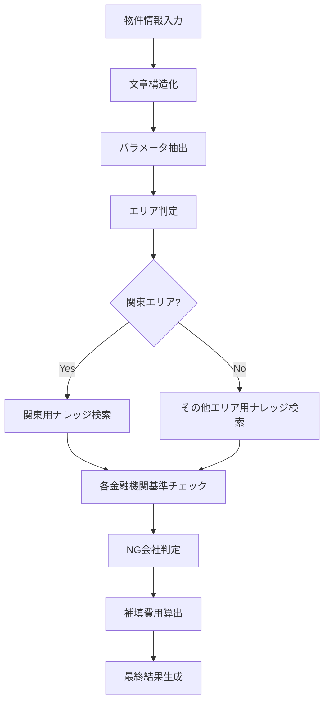

---
tags:
  - dify
  - real-estate
  - workflow-automation
  - application-manual
  - business-logic
  - supplier-docs
creation-date: 2025-02-01
---

# Dify仕入判定アプリケーション マニュアル

## 概要

このマニュアルでは、Difyプラットフォームを使用して構築された「【開発中】仕入判定_ver2.1_全国対応」アプリケーションについて説明します。本アプリケーションは、不動産の仕入れ判定を自動化し、複数の金融機関の基準に基づいて物件の評価を行います。

## 1. ナレッジについて

### 1.1 ナレッジの基礎知識

本アプリケーションでは、以下のナレッジデータベースを活用しています：

#### 主要ナレッジベース
- **NG仲介会社データベース**: 金融機関ごとの取り扱い不可能な仲介会社リスト
- **NG建物管理会社データベース**: 各金融機関で評価NGとなる建物管理会社リスト
- **NGサブリース会社データベース**: サブリース会社のブラックリスト
- **類似検索用データベース**: 曖昧一致での会社名検索用

#### データベース識別子
```yaml
dataset_ids:
  - Ir79YeYl4a9V9buBsmlR2/lH8LbNGlzkGG0RUltUdYb2RSp4J5Nn+9Lut4QHLeu9  # 完全一致検索用
  - E+oywZXam1MMaklUG6IjG7pV+hsf+HjnXkO7ITJDncZsySe7ur/G6dcCxJUcEWKX  # 複合検索用
  - iyI74NydcXiyrkQyZ2A4Kyylfj/i15XeMHXH2xhPaUEoHzaBaKyNfYmIUT1VZunH  # 類似検索用
```

### 1.2 ナレッジの更新方法

#### 1.2.1 データ形式
ナレッジベースのデータは以下の形式で格納されています：

```
会社名: {実際の会社名};カテゴリ: {仲介会社|建物管理会社|サブリース会社|賃貸管理会社|賃借人|売主}
```

例：
```
会社名: 株式会社FRAT;カテゴリ: 仲介会社
会社名: （株）プレストサービス;カテゴリ: 建物管理会社
```

#### 1.2.2 更新手順

1. **Dify管理画面へのアクセス**
   - Difyダッシュボードにログイン
   - 「ナレッジ」セクションに移動

2. **対象データベースの選択**
   - 更新対象に応じて適切なデータベースを選択
   - 仲介会社更新 → 仲介会社データベース
   - 管理会社更新 → 建物管理会社データベース

3. **データの追加・更新**
   - 「ドキュメントを追加」をクリック
   - 上記の指定形式でデータを入力
   - 保存して再インデックス化を実行

4. **検証**
   - テスト用の物件情報でワークフローを実行
   - 新しいNG会社が正しく検出されることを確認

#### 1.2.3 注意事項

- **株式会社表記の統一**: 「株式会社」と「（株）」は別扱いのため、両方の表記を登録する
- **完全一致の重要性**: 会社名は完全一致で検索されるため、表記揺れに注意
- **カテゴリの正確性**: カテゴリ分類を間違えると適切な判定ができない

## 2. ワークフローの処理内容とビジネスロジック

### 2.1 アプリケーション全体構成



### 2.2 主要処理フロー

#### 2.2.1 入力データ処理

**開始ノード（1742781950109）**
```yaml
variables:
  - label: article_info
    type: paragraph
    required: true
    max_length: 999999
```

supplier by renosyの査定・交渉画面から物件情報をコピー&ペーストで入力します。

**文章構造化（1744282688828）**
```python
# Gemini 2.5 Flashを使用してLLMで構造化
model: gemini-2.5-flash
prompt: "入力された情報を構造化して整理してください..."
```

出力フォーマット例：
```
物件名：白金高輪レジデンス
所在地：東京都港区白金1-1-1
エリア：関東
最寄駅１：白金高輪駅
最寄駅１までの徒歩分数：5
...
```

#### 2.2.2 パラメータ抽出（17441822209360）

構造化された文章から32個のパラメータを抽出：

**主要抽出パラメータ**
```yaml
parameters:
  - name: bldg_name (物件名)
  - name: address (所在地)
  - name: station1 (最寄り駅①)
  - name: walk_minute_to_station1 (徒歩分数)
  - name: floor (所在階)
  - name: stories_high (地上階層)
  - name: built_year (築年)
  - name: footprint (専有面積)
  - name: is_elevator_exist (エレベータ有無)
  - name: bathroom_type (バスタイプ)
  - name: intermediary_company (仲介会社名)
  - name: subleasing_company (サブリース会社名)
  - name: building_management_company (建物管理会社名)
  - name: prefecture (都道府県) # required: true
  # その他19パラメータ...
```

### 2.3 金融機関別基準チェック

#### 2.3.1 環境変数による基準定義

**楽天銀行基準（rakuten_ng_standard）**
```yaml
value: |
  楽天銀行では、下記の仕入基準を設けています。
  下記に該当する場合はNG 
  エリア（東京都23区外、埼玉県さいたま市、東京都府中市、東京都八王子市、神奈川県藤沢市）
  最寄駅から徒歩12分以上はNG（但し、エリアが良い場合はその限りではない）
  専有面積が18㎡~100㎡の範囲を超える場合
  
  なお、下記に該当する場合は、エリアがOKでも築年数でNG
  千葉県（対象駅：千葉駅、浦安駅、津田沼駅、松戸駅、市川駅、柏駅）の築25年以上の物件
  埼玉県（浦和駅、大宮駅、川口駅、西川口駅、武蔵浦和駅）の築25年以上の物件
  東京23区内と大阪府大阪市の築25年以上の物件
  福岡県の築20年以上の物件
  大阪府大阪市以外にある関西地方の築20年以上の物件
```

**ジャックス基準（jacks_ng_standard）**
```yaml
value: |
  ジャックスでの評価基準は次の通りです。
  ・駅徒歩：徒歩15分以上は一律NG
  ・専有面積：エリア3の18㎡未満の部屋はNG
  ・所在階：防犯、視覚ストレス対策なしの1階物件はNG
  ・エレベーターの有無：総階数が3階以上にも関わらず、エレベーターがない場合はNG
  ・バルコニーの有無：バルコニーなしはNG
  ・心理的瑕疵：自殺等の告知事項など心理的瑕疵がある住戸（上下左右の部屋もNG）
  ・築年月：旧耐震基準（1981年6月1日以前）の建物はNG
  ・洗濯機置き場：ない場合はNG
  ・セントラル給湯はNG
```

**オリックス銀行基準（orix_ng_standard）**
```yaml
value: |
  オリックス銀行での評価基準は次の通りです。
  ・駅徒歩：最寄駅から15分以上はNG。但し物件によっては評価が出る可能性あり。
  ・専有面積：18㎡以上50㎡未満はOK。範囲外の部屋はNG。関東以外の40平米以上はNG。
  ・所在階：半地下はNG
  ・総戸数：管理人室除き、総戸数20戸未満はNG
  ・エレベーターの有無：エレベーターがない場合はNG
  ・バルコニーの有無：バルコニーなしはNG
  ・心理的瑕疵：自殺等の告知事項など心理的瑕疵がある住戸（上下左右の部屋もNG）
  ・築年数：築25年以上はNG（築24年11ヶ月まで取扱可、25年突入したら完全NG）
  ・洗濯機置き場：ない場合はNG
  ・セントラル給湯はNG
```

### 2.4 NG会社判定ロジック

#### 2.4.1 検索フロー

1. **完全一致検索**（ノード例：1744189356658）
   ```yaml
   title: NG仲介会社dbから完全一致検索_ジャックス
   query_variable_selector:
     - '1744714301158'  # 検索対象会社名
     - result
   ```

2. **条件分岐**（ノード例：1744253042636）
   ```yaml
   title: IF/ELSE_仲介会社_ジャックス
   conditions:
     - comparison_operator: empty  # 完全一致結果が空の場合
       variable_selector:
         - '1744189356658'
         - result
   ```

3. **類似検索**（完全一致が失敗した場合）
   ```yaml
   title: NG仲介会社dbから類似検索_ジャックス
   multiple_retrieval_config:
     score_threshold: 0.55
     top_k: 2
     weights:
       keyword_setting:
         keyword_weight: 0.1
       vector_setting:
         vector_weight: 0.9
   ```

#### 2.4.2 結果JSON化処理

```python
def main(arg1: dict):
    try:
        row = str(arg1[0]["content"])
        company_name = row.split(';')[0].split(': ')[1]
        category = row.split(';')[1].split(': ')[1]
        print("OK")
        return {"result": {
            "status":"OK",
            "company_name": company_name,
            "category": category
        }}
    except Exception as e:
        return {"result": {
            "status":"Fail",
            "company_name": "",
            "category": ""
        }}
```

### 2.5 補填費用算出ロジック

#### 2.5.1 修繕積立補填金算出（1744358049174）

```python
def main(age_of_building: int, repair_fund_per_footprint: float, 
         area: str, repair_reserve_fund: int) -> dict:
    if age_of_building <=10 and repair_fund_per_footprint <60 and area == "関東" and repair_reserve_fund!=0:
        return{"result": 300000}
    elif age_of_building <=20 and repair_fund_per_footprint <80 and area == "関東" and repair_reserve_fund!=0:
        return{"result": 300000}
    else:
        return {"result": 0}
```

**ビジネスルール**:
- 関東エリア限定
- 築10年以下 + 平米当たり修繕積立金60円未満 → 30万円補填
- 築10-20年 + 平米当たり修繕積立金80円未満 → 30万円補填

#### 2.5.2 空室手当算出（1744358257922）

```python
def main(current_status: str, rental_price: str) -> dict:
    if current_status == "空室":
        return {"result": rental_price * 3}
    else:
        return {"result": 0}
```

**ビジネスルール**: 空室の場合、賃料の3か月分を空室手当として計上

#### 2.5.3 3点ユニット改修費算出（1744358735699）

```python
def main(bath_room_type: str) -> dict:
    if bath_room_type == "3点ユニット":     
        return {"result": 200000}
    else:
        return {"result": 0}       
```

**ビジネスルール**: 3点ユニットの場合、20万円の改修費を計上

### 2.6 出力結果生成

#### 2.6.1 会社判定結果生成（1744190071662）

複雑な文字列生成ロジックで、以下の情報を含む結果を生成：

```python
def main(is_intermediary_ng: dict, is_intermediary_ng_sub: dict,
         intermediary_company: str, is_management_ng: dict, 
         is_management_ng_sub: dict, bldg_management_company: str, 
         is_sublease_ng: dict, is_sublease_ng_sub: dict,  
         subleasing_company: str, current_status: str) -> dict:
    
    answer = '\n\n<span style="color: white; background-color: #0066FF; padding: 2px 6px; border-radius: 4px;">会社判定結果🏢<span>'
    # ... 複雑な条件分岐による結果生成
```

**出力形式**:
- 仲介会社判定結果：OK⭕️ / NG❌ / 要確認☑️ / 不明
- 建物管理会社判定結果：同上
- サブリース会社判定結果：同上

## 3. 技術仕様

### 3.1 使用モデル

- **メインLLM**: Gemini 2.0 Flash Lite
- **構造化LLM**: Gemini 2.5 Flash  
- **埋め込みモデル**: Cohere Embed Multilingual v3
- **リランキングモデル**: Cohere Rerank v3.5

### 3.2 検索設定

**完全一致検索**:
```yaml
weights:
  keyword_setting:
    keyword_weight: 1
  vector_setting:
    vector_weight: 0
score_threshold: 0.6
```

**類似検索**:
```yaml
weights:
  keyword_setting:
    keyword_weight: 0.1
  vector_setting:
    vector_weight: 0.9
score_threshold: 0.55
```

## 4. 運用上の注意点

### 4.1 データメンテナンス

1. **定期的なNG会社リストの更新**
   - 月次での新規NG会社の追加
   - 表記揺れの統一

2. **基準の変更管理**
   - 金融機関の基準変更時は環境変数を更新
   - テスト実行による動作確認必須

### 4.2 エラーハンドリング

```python
try:
    # メイン処理
except Exception as e:
    return {"result": {"status":"Fail", "company_name": "", "category": ""}}
```

各処理ノードでtry-catch構造により、エラー時でもワークフローが継続実行されます。

## 5. 今後の改善点

1. **対応エリアの拡張**: 現在関東中心 → 全国対応
2. **新規金融機関の追加**: より多くの金融機関基準への対応
3. **判定精度の向上**: LLMモデルのファインチューニング
4. **リアルタイム基準更新**: API連携による動的な基準取得

## 関連ドキュメント

- [[Dify]]
- [[Ruby on Rails 探検ガイド]]
- [[SUPPLIER_プロダクト総合説明書]]

```dataviewjs
dv.header(3, "関連ノート");
var maxLoop = Math.min(dv.current().file.tags.length, 3);
for(let i=0;i<maxLoop;i++){
dv.span(dv.current().file.tags[i]);
dv.list(dv.pages(dv.current().file.tags[i]).sort(f=>f.file.mtime.ts,"desc").limit(15).file.link);
}

for (let outgo of dv.pages('outgoing([[' + dv.current().file.name + ']])')) {
    dv.header(4, outgo.file.name);
    dv.list(outgo.file.inlinks.sort());
}

// バックリンクがあるノートも出力
let backlinks = dv.pages().where(p => p.file.inlinks && p.file.inlinks.map(l=>l.path).includes(dv.current().file.path));
if (backlinks.length > 0) {
    dv.header(3, "このノートへのバックリンク");
    dv.list(backlinks.file.link);
}

``` 