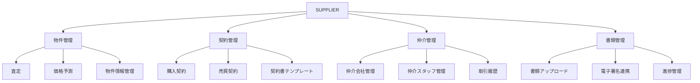

---
tags:
  - supplier
  - product-spec
  - comprehensive-guide
  - architecture
  - parmanentnote
creation-date: "2025-01-27"
---

# SUPPLIER by RENOSY プロダクト総合説明書

## 1. エグゼクティブサマリー

### 1.1 プロダクト概要
SUPPLIER by RENOSYは、不動産の仕入れ業務を効率化・高度化するための業務システムです。物件の査定から契約、書類管理、仲介会社・スタッフ管理まで、不動産仕入れに関わる一連の業務をWeb上で一元管理します。

### 1.2 主要ユーザとその役割

| ユーザタイプ | 主要な利用機能 | ビジネス価値 |
|-------------|---------------|-------------|
| **査定担当者** | [[AssessmentPage]], [[AssessmentEditPage]] | 物件価値の適正評価、効率的な査定プロセス |
| **営業担当者** | [[ManagementPage]], [[NegotiationHistory]] | 顧客対応、交渉履歴管理 |
| **契約担当者** | [[PurchaseContractsPage]], [[SalesContractTemplate]] | 契約書作成・管理、法的リスク軽減 |
| **仲介管理者** | [[IntermediaryCompaniesPage]], [[IntermediaryStaffsController]] | パートナー企業管理、業務効率化 |
| **管理者** | システム全体管理、ユーザ権限管理 | 業務統制、セキュリティ確保 |

### 1.3 ビジネス価値
- **業務効率化**: 従来の手作業・分散管理から統合システムへ
- **品質向上**: 標準化されたプロセスと履歴管理
- **リスク軽減**: 適切な権限管理とセキュリティ対策

## 2. システムアーキテクチャ

### 2.1 技術スタック

| 分類 | 技術・サービス | 役割 |
|------|---------------|------|
| **フレームワーク** | [[Ruby on Rails]] | メインアプリケーション |
| **認証** | [[devise]], [[omniauth-google-oauth2]] | ユーザ認証・Google SSO |
| **データベース** | [[PostgreSQL]] | メインデータストア |
| **キャッシュ** | [[Redis]] | セッション・キャッシュ管理 |
| **非同期処理** | [[sidekiq]] | バックグラウンドジョブ |
| **ファイル管理** | [[AWS S3]], [[cloudinary]] | ファイル保存・配信 |
| **監視** | [[Datadog]], [[Rollbar]] | パフォーマンス・エラー監視 |
| **検索** | [[ransack]] | 絞り込み・検索機能 |

### 2.2 主要なアーキテクチャ変更履歴

#### 2025年 主要変更
- **柔軟性重視のDB設計**: 書類管理における動的スキーマ対応（JSONB活用）
- **CRM機能構築**: 顧客管理機能の強化（Ph.1）
- **仲介マスタ改修**: データ品質向上・管理機能強化

#### 今後の計画
- スケーラビリティ向上（10,000社対応）
- マイクロサービス化の検討
- API連携強化

## 3. 機能一覧と変更履歴

### 3.1 主要機能マップ



### 3.2 機能別変更履歴

#### 査定機能
- **2024年**: 基本査定機能実装
- **2025年Q1**: AI価格予測機能追加
- **今後**: 査定自動化Ph.1（進行中）

#### 契約管理
- **2024年**: 基本契約管理機能
- **2025年**: DocuSign連携強化
- **今後**: 契約書自動生成機能

#### 仲介管理
- **2025年Q1**: 仲介マスタ改修プロジェクト
- **進行中**: CRM機能構築Ph.1
- **今後**: 取引実績分析機能

## 4. プロジェクト履歴

### 4.1 完了済みプロジェクト

#### SUP 2025 仲介マスタ改修
- **背景**: 仲介マスタの空白率が高い（市区町村：91.6%、支店名：95.1%）
- **目的**: データ品質向上、分析機能強化
- **成果**: マスタデータ整備、検索機能改善

#### 柔軟性重視のDB設計検討
- **背景**: 書類種別・項目の頻繁な追加要求
- **解決策**: JSONB型を活用した動的スキーマ設計
- **成果**: 開発コスト削減、運用柔軟性向上

### 4.2 進行中プロジェクト

#### SUP 2025 CRM機能構築Ph.1
- **背景**: 中期経営計画で10,000社対応が必要
- **目標**: 顧客管理機能の強化
- **進捗**: 要件定義完了、開発着手予定

#### 査定自動化Ph.1
- **目標**: 査定プロセスの自動化・効率化
- **進捗**: プロジェクト概要策定中

## 5. 技術的意思決定記録（ADR）

### ADR-001: JSONB型によるスキーマレス設計採用
- **決定**: 書類管理において柔軟性重視のDB設計を採用
- **理由**: 頻繁なスキーマ変更への対応、開発コスト削減
- **トレードオフ**: パフォーマンス vs 柔軟性

### ADR-002: DocuSign連携
- **決定**: 電子署名にDocuSignを採用
- **理由**: 法的有効性、既存システムとの親和性
- **効果**: 契約業務の電子化、プロセス短縮

## 6. ユーザフィードバック・課題

### 6.1 主要な課題・改善要望
- 仲介マスタの検索性向上（解決済み）
- 査定プロセスの自動化（対応中）
- モバイル対応の要望（検討中）

### 6.2 今後の優先課題
1. スケーラビリティ対応（10,000社対応）
2. ユーザビリティ向上
3. 自動化機能の拡充

## 7. 運用・監視

### 7.1 監視体制
- **パフォーマンス**: [[Datadog]]による24/7監視
- **エラー**: [[Rollbar]]によるリアルタイム検知
- **ログ**: [[lograge]]による構造化ログ

### 7.2 運用指標
- レスポンス時間: 平均200ms以下
- 稼働率: 99.9%以上
- エラー率: 0.1%以下

## 8. セキュリティ・コンプライアンス

### 8.1 セキュリティ対策
- [[HSTS]]による通信セキュリティ
- [[AWS Secrets Manager]]による機密情報管理
- [[devise]]による堅牢な認証システム

### 8.2 データ保護
- 個人情報の適切な管理
- アクセス権限の細かな制御
- 監査ログの保持

## 9. 今後のロードマップ

### 短期（3ヶ月）
- CRM機能Ph.1リリース
- 査定自動化Ph.1着手
- モバイル対応検討開始

### 中期（6ヶ月）
- 査定自動化Ph.1リリース
- API連携強化
- マイクロサービス化検討

### 長期（1年）
- 10,000社対応完了
- AI機能の本格展開
- 次世代アーキテクチャ移行

---

## 参考情報

### 関連ドキュメント
- [[00_SUPPLIER_全体概要]]
- [[プロダクトドキュメントの歩き方]]
- 各種技術仕様書（definitions/配下）

### 外部リンク
- [Confluence: プロジェクト概要書一覧]
- [GitHub: メインリポジトリ]
- [Slack: #supplier-team]

```dataviewjs
dv.header(3, "関連ノート");
var maxLoop = Math.min(dv.current().file.tags.length, 3);
for(let i=0;i<maxLoop;i++){
dv.span(dv.current().file.tags[i]);
dv.list(dv.pages(dv.current().file.tags[i]).sort(f=>f.file.mtime.ts,"desc").limit(15).file.link);
}
``` 