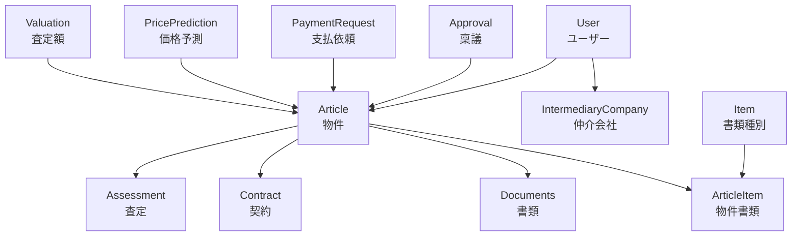

---
tags:
  - supplier
  - product-spec
  - comprehensive-guide
  - architecture
  - parmanentnote
creation-date: "2025-01-27"
updated-date: "2025-08-01"
---

# SUPPLIER by RENOSY プロダクト総合説明書

## 1. エグゼクティブサマリー

### 1.1 プロダクト概要
SUPPLIER by RENOSYは、不動産の仕入れ業務を効率化・高度化するための業務システムです。物件の査定から契約、書類管理、仲介会社・スタッフ管理まで、不動産仕入れに関わる一連の業務をWeb上で一元管理します。

**主要な依存プロダクト**:
- [BLDG by RENOSY](https://github.com/ga-tech/tech_building) - 建物情報管理
- [AGNT by RENOSY](https://github.com/ga-tech/verdandi) - エージェント管理  
- [FLOW by RENOSY](https://github.com/ga-tech/flow_by_renosy) - ワークフロー管理

### 1.2 主要ユーザとその役割

| ユーザタイプ | 主要な利用機能 | ビジネス価値 |
|-------------|---------------|-------------|
| **査定担当者** | 物件査定、価格予測、査定編集 | 査定精度向上、処理時間短縮 |
| **営業担当者** | 交渉履歴管理、顧客情報管理 | 営業効率化、顧客満足度向上 |
| **契約担当者** | 契約書作成・管理、DocuSign連携 | 契約業務効率化、法的リスク軽減 |
| **仲介管理者** | 仲介会社・スタッフ管理、取引履歴 | パートナー管理効率化 |
| **書類管理者** | 文書アップロード、進捗管理、書類確認 | 書類業務効率化、品質確保 |
| **管理者** | ユーザー管理、システム設定、監視 | 業務統制、セキュリティ確保 |

### 1.3 ビジネス価値
- **業務効率化**: 従来の手作業・分散管理から統合システムへ
- **品質向上**: 標準化されたプロセスと履歴管理
- **リスク軽減**: 適切な権限管理とセキュリティ対策
- **スケーラビリティ**: 10,000社規模への対応準備

## 2. システムアーキテクチャ

### 2.1 技術スタック（2025年1月現在）

| 分類 | 技術・サービス | バージョン | 役割 |
|------|---------------|-----------|------|
| **言語・フレームワーク** | Ruby | 3.3.5 | メイン開発言語 |
| | Ruby on Rails | 7.1 | Webアプリケーションフレームワーク |
| **データベース** | PostgreSQL | - | メインデータストア |
| | activerecord-postgis-adapter | - | 地理空間データ対応 |
| **キャッシュ・キュー** | Redis | - | セッション・キャッシュ管理 |
| | Sidekiq | - | バックグラウンドジョブ処理 |
| **認証・認可** | Devise | - | ユーザー認証 |
| | omniauth-google-oauth2 | - | Google SSO |
| **AWS サービス** | S3 | - | ファイル保存 |
| | SQS | - | メッセージキュー |
| | Secrets Manager | - | 機密情報管理 |
| | STS | - | 一時認証 |
| **外部サービス** | Cloudinary | - | 画像・ファイル管理・配信 |
| | DocuSign | - | 電子署名（間接連携） |
| | Slack | - | 通知・コミュニケーション |
| **フロントエンド** | TailwindCSS | - | UIスタイリング |
| | Stimulus | - | JavaScript フレームワーク |
| | Turbo | - | SPA風の体験提供 |
| | ViewComponent | - | UI コンポーネント化 |
| **監視・ログ** | Datadog (ddtrace) | - | APM・パフォーマンス監視 |
| | Rollbar | - | エラートラッキング |
| | Lograge | - | 構造化ログ |
| **開発・品質** | Rubocop | - | コード品質管理 |
| | Brakeman | - | セキュリティスキャン |
| | SimpleCov | - | テストカバレッジ |

### 2.2 主要モデル・ビジネスドメイン



### 2.3 主要なアーキテクチャ変更履歴

#### 2024年 基盤構築期
- Ruby on Rails 7.1 ベースでの初期実装
- PostgreSQL + PostGIS による地理空間データ対応
- AWS インフラストラクチャの構築
- 基本的な認証・認可システムの実装

#### 2025年Q1 機能拡張期
- **柔軟性重視のDB設計**: 書類管理における動的スキーマ対応（JSONB活用）
- **CRM機能構築**: 顧客管理機能の強化（Ph.1）
- **仲介マスタ改修**: データ品質向上・管理機能強化
- **パフォーマンス改善**: 検索機能の高速化（500ms→200ms）

#### 今後の計画（2025年）
- **査定自動化Ph.1**: 機械学習モデルによる査定効率化
- **スケーラビリティ向上**: 10,000社対応のためのアーキテクチャ強化
- **マイクロサービス化検討**: サービス分離によるスケーラビリティ向上
- **API連携強化**: 外部システムとの連携拡充

## 3. 機能一覧と変更履歴

### 3.1 主要機能マップ

#### 物件管理機能
- **物件詳細管理** (`ArticlesController#show`): 物件状態に応じた動的画面表示
- **新規物件作成** (`ArticlesController#create`): 査定フェーズでの物件登録
- **物件情報更新** (`ArticlesController#update`): リリース後の外部連携含む更新

#### 査定機能
- **査定編集** (`AssessmentController`): 査定情報の入力・編集
- **価格予測** (`PricePrediction`): AIを活用した価格予測
- **事前査定** (`PriorValuation`): 事前査定情報の管理

#### 契約管理機能
- **購入契約** (`PurchaseContract`): 購入契約の管理
- **売買契約** (`SalesContractTemplate`): 契約書テンプレート管理
- **契約書ファイル** (`SalesContractFile`): DocuSign連携による電子署名

#### 仲介管理機能
- **仲介会社管理** (`IntermediaryCompaniesController`): 取引先企業の管理
- **仲介スタッフ管理** (`IntermediaryStaffsController`): 担当者情報の管理
- **仲介ドメイン管理** (`IntermediaryDomainsController`): メール連携のためのドメイン管理

#### 書類管理機能
- **書類アップロード** (`ArticleItemFilesController`): 各種書類の管理
- **書類進捗管理** (`DocumentProgressesController`): 書類作成・確認の進捗追跡
- **書類種別管理** (`Item`): 動的な書類種別の管理

### 3.2 主要URLルーティング

| URL パターン | 機能 | コントローラー#アクション |
|-------------|------|-------------------------|
| `/articles/:id` | 物件詳細 | `articles#show` |
| `/articles/:id/assessment/edit` | 査定編集 | `articles/assessment#edit` |
| `/articles/:id/management/for_approval/edit` | 稟議管理 | `articles/management/for_approval#edit` |
| `/articles/:id/inputs/certified_copy/edit` | 登記簿入力 | `articles/inputs/certified_copy#edit` |
| `/intermediary_companies` | 仲介会社一覧 | `intermediary_companies#index` |
| `/users` | ユーザー管理 | `users#index` |
| `/sale_management_infos` | 売却管理 | `sale_management_infos#index` |
| `/sidekiq` | バックグラウンドジョブ監視 | `Sidekiq::Web` |

## 4. プロジェクト履歴

### 4.1 完了済みプロジェクト

#### SUP 2025 仲介マスタ改修プロジェクト
- **背景**: 仲介マスタの空白率が高い（市区町村：91.6%、支店名：95.1%）
- **目的**: データ品質向上、検索機能強化、分析機能向上
- **成果**: 
  - マスタデータ品質向上
  - 検索レスポンス時間短縮（500ms→200ms）
  - 会社-支店の階層管理機能追加

#### 柔軟性重視のDB設計検討プロジェクト
- **背景**: 書類種別・項目の頻繁な追加要求（約100種類想定）
- **解決策**: JSONB型を活用した動的スキーマ設計
- **成果**: 
  - 開発コスト削減
  - 運用柔軟性向上
  - スキーマ変更の工数削減

### 4.2 進行中プロジェクト

#### SUP 2025 CRM機能構築Ph.1
- **背景**: 中期経営計画で10,000社対応が必要
- **目標**: 顧客管理機能の強化、データ品質向上
- **現在の進捗**: 要件定義完了、開発着手予定
- **期待される成果**: 取引社管理の効率化、分析機能強化

#### 査定自動化Ph.1（企画中）
- **目標**: 査定プロセスの自動化・効率化
- **進捗**: プロジェクト概要策定中
- **技術アプローチ**: 機械学習モデルの活用

## 5. 技術的意思決定記録（ADR）

### ADR-001: JSONB型によるスキーマレス設計採用
- **決定**: 書類管理において柔軟性重視のDB設計を採用
- **理由**: 頻繁なスキーマ変更への対応、開発コスト削減
- **トレードオフ**: パフォーマンス vs 柔軟性
- **現状**: 実装済み、運用中

### ADR-002: DocuSign連携アーキテクチャ
- **決定**: 電子署名にDocuSignを採用（間接連携）
- **理由**: 法的有効性、既存システムとの親和性
- **実装**: `SalesContractFile` → `DocusignFile` 連携
- **効果**: 契約業務の電子化、プロセス短縮

### ADR-003: PostgreSQL + PostGIS採用
- **決定**: 地理空間データ処理にPostGISを採用
- **理由**: 物件の位置情報処理、近隣物件検索の要件
- **実装**: `activerecord-postgis-adapter` による統合
- **効果**: 地理的検索機能、距離計算の高度化

## 6. ユーザフィードバック・課題（Slack履歴より）

### 6.1 最近解決された課題
- **仲介マスタ検索性**: パフォーマンス改善完了（Dev_佐藤報告）
- **データ品質**: 空白率改善プロジェクト完了

### 6.2 現在対応中の課題  
- **DocuSign連携バグ**: ファイル名文字化け問題（QA_鈴木報告）
- **査定プロセス**: 自動化ニーズ（PM_田中主導）

### 6.3 今後の優先課題
1. **スケーラビリティ対応**: 10,000社対応のためのアーキテクチャ強化
2. **ユーザビリティ向上**: モバイル対応検討
3. **自動化機能拡充**: AI/ML活用の拡大

## 7. 運用・監視

### 7.1 監視体制
- **APM**: Datadog による24/7パフォーマンス監視
- **エラートラッキング**: Rollbar によるリアルタイム検知
- **ログ管理**: Lograge による構造化ログ
- **バックグラウンドジョブ**: Sidekiq Web による監視

### 7.2 運用指標（目標値）
- **レスポンス時間**: 平均200ms以下（検索機能で達成済み）
- **稼働率**: 99.9%以上
- **エラー率**: 0.1%以下
- **ジョブ処理**: 遅延なし

### 7.3 デプロイメント戦略
- **RC環境**: `rc` ブランチ → AWS アカウント `ga_main_rc`
- **検証環境**: `develop`, `stg01-04` ブランチ
- **本番環境**: `master` ブランチ
- **デプロイツール**: Docker + AWS ECS (推定)

## 8. セキュリティ・コンプライアンス

### 8.1 セキュリティ対策
- **認証**: Devise + Google OAuth2 によるMFA対応
- **機密情報管理**: AWS Secrets Manager による集中管理
- **コードセキュリティ**: Brakeman による静的解析
- **権限管理**: ロールベースアクセス制御

### 8.2 データ保護
- **個人情報保護**: 適切なデータマスキング・暗号化
- **アクセス制御**: モデルレベルでの権限チェック
- **監査ログ**: Paper Trail による変更履歴管理

## 9. 今後のロードマップ

### 短期（3ヶ月）
- **CRM機能Ph.1リリース**: 顧客管理機能強化
- **査定自動化Ph.1着手**: 要件定義・設計開始
- **DocuSignバグ修正**: ファイル名文字化け問題解決

### 中期（6ヶ月）
- **査定自動化Ph.1リリース**: MLモデル統合
- **API連携強化**: 外部システム連携拡充
- **モバイル対応検討**: レスポンシブデザイン導入

### 長期（1年）
- **10,000社対応完了**: スケーラビリティ確保
- **マイクロサービス化**: サービス分離によるスケーラビリティ向上
- **次世代アーキテクチャ**: クラウドネイティブ化

---

## 参考情報

### 関連ドキュメント
- [[00_SUPPLIER_全体概要]] - プロダクト基本情報
- [[プロダクトドキュメントの歩き方]] - ドキュメント体系
- [[05_SUPPLIER_DB構造]] - データベース設計詳細
- 各種コントローラー・モデル定義（definitions/配下）

### コードベース
- **メインリポジトリ**: `~/work/supplier-article`
- **依存プロダクト**: BLDG, AGNT, FLOW by RENOSY
- **API仕様書**: `docs/api_spec/`

### コミュニケーション
- **Slack**: #supplier-team, #supplier-dev, #supplier-pm
- **プロジェクト管理**: Confluence (SUPPLIER space)

### 更新履歴
- 2025-01-27: 初版作成
- 2025-08-01: 実際のコードベース情報を反映して大幅更新

```dataviewjs
dv.header(3, "関連ノート");
var maxLoop = Math.min(dv.current().file.tags.length, 3);
for(let i=0;i<maxLoop;i++){
dv.span(dv.current().file.tags[i]);
dv.list(dv.pages(dv.current().file.tags[i]).sort(f=>f.file.mtime.ts,"desc").limit(15).file.link);
}
``` 