# SUPPLIER by RENOSY データベース構造ドキュメント

## モデル一覧と役割

| モデル名 | 主な役割 | 主要な関連 |
|---|---|---|
| User | [[ユーザー]]情報を管理 | has_many :articles, has_many :approvals, has_many :intermediary_companies, ... |
| Article | [[物件]]情報を管理 | belongs_to :user, has_many :article_items, has_many :negotiation_histories, ... |
| ArticleItem | 物件に紐づく[[書類]]情報 | belongs_to :article, belongs_to :item, has_many :article_item_files, ... |
| Item | 書類種別マスタ | has_many :article_items |
| Approval | [[仕入稟議]]申請管理 | belongs_to :article, belongs_to :user, has_one :approval_detail, has_many :approval_status_histories |
| ApprovalDetail | 稟議の詳細情報 | belongs_to :approval |
| ApprovalStatusHistory | 稟議のステータス履歴 | belongs_to :approval, belongs_to :actor (User), has_one :approval_status_history_comment |
| ApprovalStatusHistoryComment | ステータス履歴のコメント | belongs_to :approval_status_history, belongs_to :user |
| NegotiationHistory | [[交渉履歴]] | belongs_to :article |
| SaleApproval | [[販売稟議]] | belongs_to :article, has_many :status_histories, has_one :detail |
| SaleApproval::StatusHistory | 販売稟議のステータス履歴 | belongs_to :sale_approval, belongs_to :actor (User), has_one :comment |
| SaleApproval::StatusHistory::Comment | ステータス履歴のコメント | belongs_to :sale_approval_status_history, belongs_to :user |
| SaleApproval::Detail | 販売稟議の詳細 | belongs_to :sale_approval |
| IntermediaryCompany | [[仲介会社]]マスタ | has_many :intermediary_staffs, belongs_to :user |
| IntermediaryStaff | 仲介担当者 | belongs_to :intermediary_company, has_many :intermediary_staff_users, has_many :users, through: :intermediary_staff_users |
| IntermediaryStaffUser | 仲介担当者とユーザーの中間 | belongs_to :intermediary_staff, belongs_to :user |
| IntermediaryDomain | 仲介会社ドメイン | belongs_to :intermediary_company, belongs_to :user |
| SupplierMail | 査定メール管理 | belongs_to :contact_person (User), belongs_to :intermediary_company, has_many :attachments, has_many :articles |
| Attachment | メール添付ファイル | belongs_to :supplier_mail, belongs_to :article |
| ConsumptionTaxVersion | [[消費税計算]]履歴 | belongs_to :article, belongs_to :user |
| PaymentRequest | [[支払い依頼]] | belongs_to :article, belongs_to :user, has_many :payment_request_comments |
| PaymentRequestComment | 支払い依頼のコメント | belongs_to :payment_request |
| SaleMaisokuProgress | [[販売用マイソク作成進捗]] | belongs_to :article, belongs_to :creator (User), belongs_to :checker (User) |
| SaleManagementInfo | [[発表管理]] | belongs_to :article, belongs_to :bank |
| SalesContractField | [[契約書関連項目]] | belongs_to :article, belongs_to :sales_contract_template |
| SalesContractFile | [[契約書ファイル]] | belongs_to :sales_contract_field, has_many :docusign_files |
| DocusignFile | [[DocuSignファイル]] | belongs_to :sales_contract_file |
| SalesContractTemplate | [[契約書テンプレート]] | - |
| SalesDestination | [[卸先事業マスタ]] | has_many :sales_destination_articles |
| SalesDestinationArticle | 卸先事業と物件の中間 | belongs_to :sales_destination, belongs_to :article |
| SalesInfo | [[発表詳細]] | belongs_to :article |
| SalesPropertiesSheetField | [[販売物件管理スプレッドシート項目]] | belongs_to :article |
| Building | [[建物マスタ]] | has_many :articles |
| BuildingConfirmation | [[建物情報確認]] | belongs_to :article, belongs_to :user |
| Janitor | [[建物管理員]] | belongs_to :article |
| Jikoshintaku | [[自己信託マスタ]] | has_many :jikoshintaku_articles, has_many :articles, through: :jikoshintaku_articles |
| JikoshintakuArticle | 自己信託と物件の中間 | belongs_to :jikoshintaku, belongs_to :article |
| OwnrInfo | [[OWNRアプリ情報]] | belongs_to :article |
| Comment | [[コメント]] | belongs_to :article, belongs_to :user |
| Label | [[ラベル]] | - |
| BusinessPartner | [[ビジネスパートナー]] | has_many :users |
| Prefecture | [[都道府県マスタ]] | has_many :intermediary_companies |
| PricePrediction | [[価格推定結果]] | belongs_to :article |
| PriorValuation | [[事前評価]] | belongs_to :article, belongs_to :user |
| PriorValuationResult | [[事前評価結果]] | belongs_to :prior_valuation, belongs_to :bank |
| Valuation | [[銀行評価]] | belongs_to :article, belongs_to :bank |
| ValuationHistory | [[銀行評価履歴]] | belongs_to :valuation |
| ... | ... | ... |

> ※一部省略。サブディレクトリ（input, users, types, v1等）や特殊用途モデルも含めて随時追記してください。

---

## ER図（Mermaid.js）

```mermaid
erDiagram
    USER ||--o{ ARTICLE : "has many"
    USER ||--o{ APPROVAL : "has many"
    USER ||--o{ INTERMEDIARY_COMPANY : "has many"
    USER ||--o{ INTERMEDIARY_DOMAIN : "has many"
    USER ||--o{ INTERMEDIARY_STAFF : "has many"
    USER ||--o{ SUPPLIER_MAIL : "has many"
    USER ||--o{ PAYMENT_REQUEST : "has many"
    USER ||--o{ BUILDING_CONFIRMATION : "has many"
    USER ||--o{ SALE_MAISOKU_PROGRESS : "has many (creator/checker)"
    USER ||--o{ CONSUMPTION_TAX_VERSION : "has many"
    USER ||--o{ PRIOR_VALUATION : "has many"
    USER ||--o{ COMMENT : "has many"
    USER ||--o{ USERS_SETTING : "has one"
    USER ||--o{ INTERMEDIARY_STAFF_USER : "has many"
    USER ||--o{ APPROVAL_STATUS_HISTORY : "as actor"
    USER ||--o{ SALE_APPROVAL_STATUS_HISTORY : "as actor"

    ARTICLE ||--o{ ARTICLE_ITEM : "has many"
    ARTICLE ||--o{ NEGOTIATION_HISTORY : "has many"
    ARTICLE ||--o{ APPROVAL : "has many"
    ARTICLE ||--o{ PAYMENT_REQUEST : "has many"
    ARTICLE ||--o{ SALE_MAISOKU_PROGRESS : "has many"
    ARTICLE ||--o{ SALE_MANAGEMENT_INFO : "has many"
    ARTICLE ||--o{ SALES_CONTRACT_FIELD : "has many"
    ARTICLE ||--o{ SALES_INFO : "has one"
    ARTICLE ||--o{ SALES_PROPERTIES_SHEET_FIELD : "has one"
    ARTICLE ||--o{ BUILDING_CONFIRMATION : "has many"
    ARTICLE ||--o{ JANITOR : "has one"
    ARTICLE ||--o{ JIKOSHINTAKU_ARTICLE : "has many"
    ARTICLE ||--o{ OWN_INFO : "has one"
    ARTICLE ||--o{ COMMENT : "has many"
    ARTICLE ||--o{ PRICE_PREDICTION : "has many"
    ARTICLE ||--o{ PRIOR_VALUATION : "has many"
    ARTICLE ||--o{ VALUATION : "has many"
    ARTICLE ||--o{ SALES_DESTINATION_ARTICLE : "has many"
    ARTICLE ||--o{ DOCUMENT_PROGRESS : "has many"
    ARTICLE ||--o{ CONSUMPTION_TAX_VERSION : "has many"
    ARTICLE ||--o{ PURCHASE_CONTRACT : "has many"

    ARTICLE_ITEM }o--|| ITEM : "belongs to"
    ARTICLE_ITEM ||--o{ ARTICLE_ITEM_FILE : "has many"
    ARTICLE_ITEM ||--o{ INPUT_CERTIFIED_COPY : "has one"
    ARTICLE_ITEM ||--o{ INPUT_TENANT_LEASE_AGREEMENT : "has one"
    ARTICLE_ITEM ||--o{ INPUT_REPORT_OF_IMPORTANT_INFO_SURVEY : "has one"
    ARTICLE_ITEM ||--o{ INPUT_SALES_AGREEMENT_ON_PURCHASE : "has one"
    ARTICLE_ITEM ||--o{ INPUT_PAMPHLET : "has one"
    ARTICLE_ITEM ||--o{ INPUT_CONSULTING_OUTSOURCING_AGREEMENT : "has one"
    ARTICLE_ITEM ||--o{ INPUT_COMPENSATION_PAYMENT_AGREEMENT : "has one"
    ARTICLE_ITEM ||--o{ INPUT_SALES_AGREEMENT_AB : "has one"
    ARTICLE_ITEM ||--o{ INPUT_VALUATION_CERTIFICATE : "has one"

    APPROVAL ||--|| APPROVAL_DETAIL : "has one"
    APPROVAL ||--o{ APPROVAL_STATUS_HISTORY : "has many"
    APPROVAL_STATUS_HISTORY ||--|| APPROVAL_STATUS_HISTORY_COMMENT : "has one"

    SALE_APPROVAL ||--o{ SALE_APPROVAL_STATUS_HISTORY : "has many"
    SALE_APPROVAL ||--|| SALE_APPROVAL_DETAIL : "has one"
    SALE_APPROVAL_STATUS_HISTORY ||--|| SALE_APPROVAL_STATUS_HISTORY_COMMENT : "has one"

    INTERMEDIARY_COMPANY ||--o{ INTERMEDIARY_STAFF : "has many"
    INTERMEDIARY_COMPANY ||--o{ INTERMEDIARY_DOMAIN : "has many"
    INTERMEDIARY_STAFF ||--o{ INTERMEDIARY_STAFF_USER : "has many"
    INTERMEDIARY_STAFF_USER }o--|| USER : "belongs to"
    INTERMEDIARY_DOMAIN }o--|| USER : "belongs to"

    SUPPLIER_MAIL ||--o{ ATTACHMENT : "has many"
    SUPPLIER_MAIL ||--o{ ARTICLE : "has many"
    ATTACHMENT }o--|| ARTICLE : "belongs to"

    SALES_CONTRACT_FIELD ||--o{ SALES_CONTRACT_FILE : "has many"
    SALES_CONTRACT_FILE ||--o{ DOCUSIGN_FILE : "has many"

    SALES_DESTINATION ||--o{ SALES_DESTINATION_ARTICLE : "has many"
    SALES_DESTINATION_ARTICLE }o--|| ARTICLE : "belongs to"

    JIKOSHINTAKU ||--o{ JIKOSHINTAKU_ARTICLE : "has many"
    JIKOSHINTAKU_ARTICLE }o--|| ARTICLE : "belongs to"

    PAYMENT_REQUEST ||--o{ PAYMENT_REQUEST_COMMENT : "has many"

    BUILDING ||--o{ ARTICLE : "has many"

    PRIOR_VALUATION ||--o{ PRIOR_VALUATION_RESULT : "has many"
    PRIOR_VALUATION_RESULT }o--|| BANK : "belongs to"
    VALUATION ||--o{ VALUATION_HISTORY : "has many"
    VALUATION }o--|| BANK : "belongs to"

```

---

## テーブル定義詳細

### users テーブル

| カラム名 | データ型 | 備考 |
|---|---|---|
| id | integer | 主キー |
| email | string | null: false, default: "", コメント: メールアドレス |
| encrypted_password | string | null: false, default: "", コメント: 暗号化パスワード |
| sign_in_count | integer | null: false, default: 0, コメント: サインイン回数 |
| current_sign_in_at | datetime | コメント: 現サインイン日時 |
| last_sign_in_at | datetime | コメント: 前回サインイン日時 |
| current_sign_in_ip | inet | コメント: 現サインインIP |
| last_sign_in_ip | inet | コメント: 前回サインインIP |
| name | string | コメント: 名前 |
| created_at | datetime | null: false |
| updated_at | datetime | null: false |
| type | string | null: false, default: "Salesperson", コメント: タイプ |
| chatwork_id | integer | コメント: チャットワークID |
| department_id | integer | コメント: 使用していない |
| mobile_phone | string | コメント: 携帯電話番号 |
| authority | text[] | null: false, default: [], コメント: 権限管理用カラム |
| business_partner_id | integer | コメント: ビジネスパートナーID |
| leave | boolean | null: false, default: false, コメント: 退職フラグ |

---

### articles テーブル

| カラム名 | データ型 | 備考 |
|---|---|---|
| id | integer | 主キー |
| building_name | text | コメント: 建物名 |
| zip | string | コメント: 郵便番号 |
| prefecture | text | コメント: 住所１ |
| state | text | コメント: 住所２ |
| city | text | コメント: 住所３ |
| street | text | コメント: 住所４ |
| area | integer | コメント: 使用していない |
| built_year | integer | コメント: 築年月 |
| station_name | text | コメント: 最寄駅１ |
| station_walk_minute | integer | コメント: 駅徒歩（分）１ |
| ... | ... | ... |

> ※カラムが非常に多いため、詳細は[[articlesテーブル詳細]]ノートに分割推奨。

---

### article_items テーブル

| カラム名 | データ型 | 備考 |
|---|---|---|
| id | integer | 主キー |
| item_id | integer | コメント: 書類ID |
| article_id | integer | コメント: 物件ID |
| uploaded_date | date | コメント: アップロード日 |
| schd_upload_date | date | コメント: アップロード予定日 |
| remark | text | コメント: 備考 |
| additionally_confirmed | boolean | コメント: 備考チェック |
| created_at | datetime | null: false |
| updated_at | datetime | null: false |

---

### approvals テーブル

| カラム名 | データ型 | 備考 |
|---|---|---|
| id | integer | 主キー |
| article_id | integer | コメント: article_id |
| user_id | integer | コメント: user_id |
| name | string | コメント: 稟議書（carrierwaveでマウントするカラム） |
| change_name | string | コメント: 変更稟議事情説明書（carrierwaveでマウントするカラム） |
| status | integer | コメント: 稟議のステータス |
| kintone_id | integer | コメント: kintone上でのID |
| no | integer | コメント: 稟議申請回数。2以降は変更稟議。 |
| comment | text | コメント: コメント |
| created_at | datetime | null: false |
| updated_at | datetime | null: false |
| ... | ... | ... |

---

### intermediary_companies テーブル

| カラム名 | データ型 | 備考 |
|---|---|---|
| id | integer | 主キー |
| name | string | null: false, コメント: 仲介会社名 |
| user_id | integer | コメント: GA担当者 |
| monthly_handing_number | integer | コメント: 1ヶ月の取り扱い件数 |
| ... | ... | ... |

---

### sales_contract_fields テーブル

| カラム名 | データ型 | 備考 |
|---|---|---|
| id | integer | 主キー |
| article_id | integer | コメント: article_id |
| created_at | datetime | null: false |
| updated_at | datetime | null: false |
| has_accessory_building | boolean | default: false, コメント: 付属建物の有無 |
| ... | ... | ... |

> ※各テーブルの全カラム詳細は[[schema.rb]]や各種ノートで参照してください。

---

（この他のテーブルも必要に応じて追記してください） 

---

## 全モデル名リスト（ファイル・クラス名ベース/サブディレクトリ含む）

- year_month.rb
- yield_calculator.rb
- zenrin_map.rb
- valuation.rb
- valuation_history.rb
- unmounted_article_item_file.rb
- user.rb
- suggested_rental_price.rb
- supplier.rb
- supplier_mail.rb
- system_setting.rb
- tax.rb
- sales_properties_sheet_field.rb
- sales_term.rb
- salesperson.rb
- sanitize_building_name.rb
- settlement_agent.rb
- shooting_info.rb
- sales_contract_template.rb
- sales_destination.rb
- sales_destination_article.rb
- sales_info.rb
- sale_maisoku_progress.rb
- sale_management_info.rb
- sale_price_calculator.rb
- sales_contract_field.rb
- sales_contract_file.rb
- purchase_contract.rb
- sale_approval.rb
- pdf.rb
- prefecture.rb
- price_prediction.rb
- prior_valuation.rb
- other_company_negotiation.rb
- ownr_info.rb
- payment_request.rb
- payment_request_comment.rb
- manager.rb
- mst_jusyo_jp.rb
- negotiation_history.rb
- negotiation_schedule.rb
- notifier.rb
- item.rb
- janitor.rb
- jikoshintaku.rb
- jikoshintaku_article.rb
- label.rb
- lancers_operator.rb
- loan_agent.rb
- mail_body_extractor.rb
- intermediary_company.rb
- intermediary_domain.rb
- intermediary_staff.rb
- intermediary_staff_user.rb
- grow_year_month_formatter.rb
- incomplete_document.rb
- input.rb
- file_published_date.rb
- file_tab.rb
- file_tab_collection.rb
- docusign_file.rb
- docusign_info.rb
- document_progress_label.rb
- current.rb
- data_maintainer.rb
- document_manager.rb
- document_progress.rb
- consumption_tax_version.rb
- cash_flow_calculator.rb
- cash_flow_criterion_article.rb
- cash_flow_criterion_calculator.rb
- comment.rb
- business_partner.rb
- buyback_reason.rb

### サブディレクトリ（抜粋）

#### input/
- valuation_certificate.rb
- consulting_outsourcing_agreement.rb
- pamphlet.rb
- report_of_important_info_survey.rb
- sales_agreement_ab.rb
- sales_agreement_on_purchase.rb
- tenant_lease_agreement.rb
- compensation_payment_agreement.rb
- confirmation.rb
- compare.rb
- check.rb
- base.rb
- certified_copy.rb

#### input/check/
- pamphlet.rb
- report_of_important_info_survey.rb
- sales_agreement_ab.rb
- sales_agreement_on_purchase.rb
- tenant_lease_agreement.rb
- valuation_certificate.rb
- base.rb
- certified_copy.rb
- compensation_payment_agreement.rb
- consulting_outsourcing_agreement.rb

#### input/confirmation/
- tenant_lease_agreement.rb
- valuation_certificate.rb
- pamphlet.rb
- report_of_important_info_survey.rb
- sales_agreement_ab.rb
- sales_agreement_on_purchase.rb
- base.rb
- certified_copy.rb
- compensation_payment_agreement.rb
- consulting_outsourcing_agreement.rb

#### input/compare/
- compensation_payment_agreement.rb
- report_of_important_info_survey.rb
- sales_agreement_on_purchase.rb
- tenant_lease_agreement.rb
- certified_copy.rb

#### input/certified_copy/
- form.rb
- land_address.rb

#### users/
- setting.rb

#### user/
- authorizer.rb

#### types/
- type_date_time_with_zone.rb

#### tech_building/
- building_image.rb
- advertisement_railway_station.rb
- building.rb
- building_file.rb
- building_files_fetcher.rb

#### negotiation_history/
- presenter.rb

#### valuation_history/
- presenter.rb

#### sale_approval/
- status_history.rb
- create_form.rb
- detail.rb

#### sales_contract_files/
- renosy_wide_sublease_management_fee.rb
- sales_agreement.rb
- transfer_request_form.rb
- vacancy_guarantee_agreement.rb
- presentation_of_important_info_collection_agency_pro.rb
- ...（多数）

#### prior_valuation/
- index_form.rb
- result.rb
- create_form.rb

#### purchase_contract/
- cancellation.rb
- transaction_register.rb

#### payment_request/
- send_to_flow.rb
- update_form.rb

#### document_progresses/
- api_client.rb
- api_response_formatter.rb
- card_list_builder.rb

#### certified_copy/
- ...

#### shiho_shoshi/
- registration_document_builder.rb
  - registration_documents/
    - base.rb
    - normal.rb
    - orix.rb

#### sale_maisoku/
- pdf_generator.rb

#### sale_maisoku_progress/
- status_manager.rb

#### notifiers/
- rental_price_assessment_request.rb
- valuation_certificate_required_articles.rb
- ownr_bring_back_contract_files.rb

#### csv/
- generator.rb
- prior_valuation.rb
- purchase_contract.rb

#### validator/
- date.rb

#### form/
- negotiation_history.rb
- valuation_histories.rb

#### google_api/
- authorizer.rb
- gmail.rb

#### document_reader/maisoku/
- article_response_formatter.rb
- article_updater.rb

---

> ※このリストはファイル名ベースです。クラス名・役割・関連は順次追記します。 