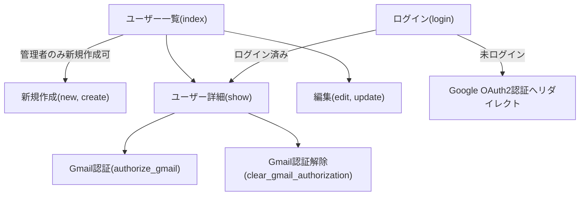

# UsersController

## 役割
このコントローラは、[[User]]モデルのユーザー管理（一覧表示、詳細表示、新規作成、編集、削除、Gmail認証など）を担当します。管理者権限の有無によってアクセス制御が行われます。

## 処理フロー

## アクション一覧
- `index`: ユーザー一覧を表示。[[users/index.html.erb]]
- `show`: ユーザー詳細を表示。Gmail認証用URLも表示。[[users/show.html.erb]]
- `new`: 新規ユーザー作成フォームを表示（管理者のみ）。[[users/new.html.erb]]/[[users/_form.html.erb]]
- `edit`: ユーザー編集フォームを表示（管理者のみ）。[[users/edit.html.erb]]/[[users/_form.html.erb]]
- `create`: ユーザーを新規作成（管理者のみ）。失敗時は`new`を再表示。
- `update`: ユーザー情報を更新（管理者のみ）。失敗時は`edit`を再表示。
- `login`: ログイン状態に応じてリダイレクト。未ログイン時はGoogle OAuth2認証へ。
- `authorize_gmail`: Gmail認証コードを受け取り、認証処理を実行。
- `clear_gmail_authorization`: Gmail認証情報を削除。

## コールバック
- `before_action :authenticate_user!`（except: :login）: ログイン必須。
- `skip_before_action :verify_authenticity_token`（only: :create）: CSRFトークン検証スキップ。
- `skip_before_action :reject_unauthorized_user`（only: :create）: 権限チェックスキップ。

## Strong Parameters
- `create_params`:
  - `:name`, `:email`, `:mobile_phone`, `:leave`, `:type`, `authority: []`
- `update_params`:
  - `:name`, `:mobile_phone`, `:leave`, `:type`, `authority: []`
- `search_params`:
  - `:name`, `:email`, `:leave`, `:type`, `:authority`

## 関連モデル
- [[User]]

## 関連ビュー
- [[users/index.html.erb]]
- [[users/show.html.erb]]
- [[users/new.html.erb]]
- [[users/edit.html.erb]]
- [[users/_form.html.erb]]
- [[users/_search_form.html.erb]] 